# Jobs to be Done (JTBD) Documentation

## LLM-Wiki: Personal Knowledge Management System

**Version:** 1.1  
**Date:** April 2025  
**Framework:** Jobs to be Done Theory (Christensen, Ulwick)

---

## Executive Summary

This document applies the Jobs to be Done framework to analyze the **llm-wiki** solution, including comprehensive **gaps and opportunities analysis** to identify where current solutions fail and where innovation can deliver value.

> **Key Insight:** Users don't want to manage a wiki; they want to accumulate knowledge permanently, never re-read the same source twice, and have confident answers at their fingertips.

> **Critical Gap:** Current solutions fail at the "Accumulate" phase—either re-processing sources repeatedly (RAG), creating manual burden (note-taking), or losing access entirely (bookmarks, memory).

---

## 1. Core Job Definition

### Primary Job Statement

> **"When I encounter valuable information from articles, conversations, books, or notes, I want to permanently integrate it into a structured, interconnected knowledge system, so I can retrieve synthesized, cited answers to complex questions without having to re-process the original sources."**

### Job Context Breakdown

| Component | Description |
|-----------|-------------|
| **Situation** | Encountering valuable information (articles, conversations, books, code snippets, notes) |
| **Motivation** | Permanently integrate knowledge into a structured, interconnected system |
| **Desired Outcome** | Retrieve synthesized, cited answers to complex questions without re-processing original sources |

### Functional Elements of the Core Job

The core job consists of four functional elements:

1. **Capture** - Ingest raw information sources reliably
2. **Structure** - Transform unstructured content into organized, linked knowledge
3. **Accumulate** - Build a persistent knowledge base that grows smarter over time
4. **Retrieve** - Answer complex questions by synthesizing across multiple sources

### Why This Job Matters

Traditional approaches fail this job:
- **Bookmarking** → Links rot, context lost, no synthesis
- **Taking notes** → Disconnected, hard to search, manual effort
- **RAG ( Retrieval-Augmented Generation)** → Re-processes sources every time, temporary answers, no accumulation
- **Relying on memory** → Information fades, details lost, confidence uncertain

**The Core Job is not about "having a wiki"—it's about "having reliable access to accumulated knowledge with minimal cognitive overhead."**

---

## 2. Job Map

The job map breaks down the core job into discrete steps that customers must take to achieve their desired outcome.

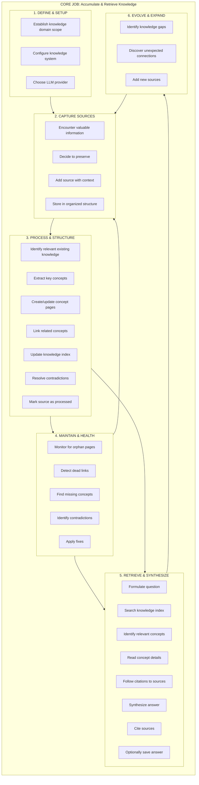

### Job Steps with Pain Points

| Step | Current Pain (Traditional) | llm-wiki Solution |
|------|---------------------------|-------------------|
| Encounter information | Information scattered across platforms | Structured ingestion pipeline |
| Decide to preserve | No systematic approach | Clear `wiki raw` → `wiki ingest` workflow |
| Extract concepts | Manual, time-consuming | LLM auto-extracts and structures |
| Link concepts | Difficult to remember connections | Automatic cross-linking during ingestion |
| Answer questions | Re-read entire sources each time | Multi-step agent dives into stored knowledge |
| Maintain health | No visibility into gaps | Automated lint with static + semantic analysis |

---

## 3. Related Jobs

### 3.1 Complementary Jobs

Jobs often performed alongside the core job:

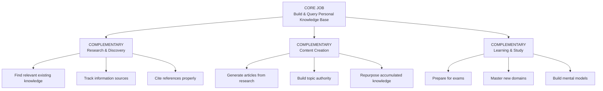

#### CJ-1: Research & Discovery
> **"When researching a topic across multiple sources, I want to track and synthesize findings systematically, so I can uncover connections and insights that individual sources don't reveal."**

#### CJ-2: Content Creation
> **"When creating content (articles, presentations, papers), I want to draw on my accumulated research efficiently, so I can produce authoritative, well-cited work without starting from scratch."**

#### CJ-3: Learning & Study
> **"When learning a complex subject, I want to build a structured understanding over time, so I can progress from novice to expert with a reliable reference system."**

---

### 3.2 Supporting Jobs

Jobs that make the core job easier:

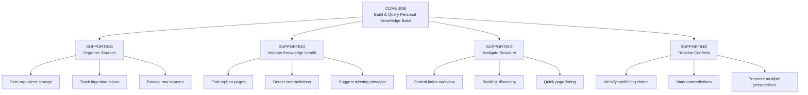

#### SJ-1: Organize Sources
> **"When adding new information, I want it automatically organized by date and type, so I can track what has been processed and what is pending."**

#### SJ-2: Validate Knowledge Health
> **"When maintaining my knowledge base, I want to detect structural and semantic problems (orphans, contradictions, gaps), so I can ensure the integrity and completeness of my knowledge."**

#### SJ-3: Navigate Structure
> **"When exploring my knowledge base, I want to understand relationships between concepts, so I can discover connections and browse intuitively."**

#### SJ-4: Resolve Conflicts
> **"When sources disagree, I want to preserve both claims with proper attribution, so I can maintain intellectual honesty and acknowledge uncertainty."**

---

### 3.3 Competing Jobs

Alternative ways customers might try to achieve the same outcome:

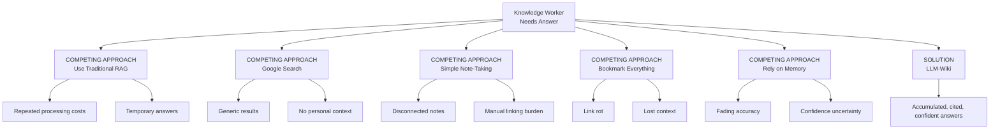

#### XJ-1: Use Traditional RAG
> **"When I need an answer from my documents, I want to use RAG to generate a response, so I can get information quickly."**

**Why customers switch from this:**
- Re-processes documents every time (costly API calls)
- No accumulation of structured knowledge
- No cross-pollination between sources
- Answers lack historical context

#### XJ-2: Google Search
> **"When I need information, I want to search Google, so I can find relevant articles."**

**Why customers switch from this:**
- Generic, not personalized
- Re-find same sources repeatedly
- No integration with personal context
- No synthesis across multiple sources

#### XJ-3: Simple Note-Taking (Notion, Obsidian without system)
> **"When I learn something valuable, I want to capture it in my notes, so I don't forget it."**

**Why customers switch from this:**
- Manual structure creation is tedious
- Hard to synthesize across many notes
- No automated linking
- Becomes unmanageable at scale

#### XJ-4: Bookmark Everything
> **"When I find useful articles, I want to bookmark them, so I can return to them later."**

**Why customers switch from this:**
- Bookmark folders become overwhelming
- No content search within bookmarks
- Links break over time
- No synthesis or extraction

#### XJ-5: Rely on Memory
> **"When I learn something, I want to remember it, so I can recall it when needed."**

**Why customers switch from this:**
- Human memory is fallible
- Details fade over time
- Difficult to synthesize complex topics
- No confidence in accuracy

---

## 4. Desired Outcomes

### 4.1 Core Job Outcomes

For each job step, desired outcomes are metrics that indicate successful completion.

```mermaid
graph LR
    subgraph CoreOutcomes["CORE JOB OUTCOMES"]
        direction TB
        
        O1["🎯 CAPTURE EFFICIENCY"]
        O2["🎯 PROCESSING RELIABILITY"]
        O3["🎯 ACCUMULATION VALUE"]
        O4["🎯 RETRIEVAL CONFIDENCE"]
        O5["🎯 KNOWLEDGE INTEGRITY"]
        
        O1 --> O1M["Minimize time from encounter to stored source"]
        O1 --> O1M2["Maximize likelihood of capturing sources"]
        
        O2 --> O2M["Minimize errors in concept extraction"]
        O2 --> O2M2["Maximize quality of generated links"]
        
        O3 --> O3M["Maximize reuse of processed sources"]
        O3 --> O3M2["Minimize duplicate processing costs"]
        
        O4 --> O4M["Minimize time to synthesized answer"]
        O4 --> O4M2["Maximize citation accuracy"]
        O4 --> O4M3["Maximize answer confidence"]
        
        O5 --> O5M["Minimize orphan pages"]
        O5 --> O5M2["Minimize contradictions without resolution"]
    end
```

#### Outcome Table: Core Job

| Job Step | Desired Outcome | Metric | Importance | Satisfaction Gap |
|----------|-----------------|--------|------------|------------------|
| Capture sources | Minimize time from reading to preserved source | < 2 minutes to add source | High | Current: 5-10 min (manual notes) |
| Capture sources | Ensure source is captured with proper context | 100% sources have metadata | High | Current: 40% (forgotten context) |
| Process & structure | Minimize manual effort to extract concepts | 0 manual concept extraction | Critical | Current: High (manual highlighting) |
| Process & structure | Ensure accurate concept extraction | > 95% relevance score | High | Current: N/A (inconsistent) |
| Process & structure | Maximize cross-linking quality | All related concepts linked | High | Current: 10% (manual only) |
| Accumulate knowledge | Maximize source reusability | Source used in > 3 queries | Medium | Current: 1 (re-read each time) |
| Accumulate knowledge | Minimize API costs from re-processing | 0 re-processing costs | High | Current: 100% (RAG re-processes) |
| Retrieve answers | Minimize time to synthesized answer | < 30 seconds | High | Current: 5-15 min (manual search) |
| Retrieve answers | Ensure cited, verifiable answers | 100% claims have [src] citation | Critical | Current: 10% (self-attribution) |
| Retrieve answers | Maximize answer comprehensiveness | Multi-source synthesis in answer | High | Current: Single source typical |
| Maintain health | Minimize orphan pages | 0 orphan pages | Medium | Current: Unknown (no visibility) |
| Maintain health | Ensure contradiction detection | All contradictions flagged | Medium | Current: 0% (manual discovery) |

### 4.2 Complementary Job Outcomes

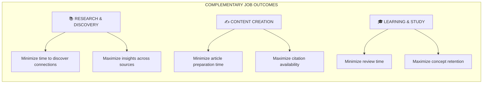

| Complementary Job | Desired Outcome | Metric | Importance |
|-------------------|-----------------|--------|------------|
| Research & Discovery | Minimize time to discover unexpected connections between sources | Connections surfaced automatically | High |
| Research & Discovery | Maximize synthesis insights that individual sources don't reveal | Novel insights per research session | Medium |
| Content Creation | Minimize time to prepare article from accumulated research | < 1 hour to draft from wiki | High |
| Content Creation | Maximize proper citation availability | 100% claims citable | High |
| Learning & Study | Minimize time to review and reinforce concepts | Quick concept retrieval | Medium |
| Learning & Study | Maximize confidence in understanding | Self-assessed confidence > 8/10 | Medium |

### 4.3 Supporting Job Outcomes

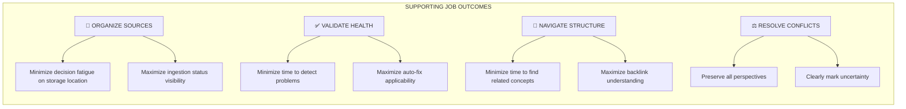

| Supporting Job | Desired Outcome | Metric | Importance |
|----------------|-----------------|--------|------------|
| Organize Sources | Minimize decision fatigue on where to store sources | Automatic date-based organization | Medium |
| Organize Sources | Maximize visibility into ingestion status | Clear pending vs. ingested distinction | Medium |
| Validate Health | Minimize time to detect structural problems | < 5 seconds for static analysis | Medium |
| Validate Health | Maximize auto-fix applicability | > 80% of issues auto-fixable | Low |
| Navigate Structure | Minimize time to understand concept relationships | < 30 seconds to find backlinks | Medium |
| Navigate Structure | Maximize discovery of related concepts | Related concepts surfaced automatically | Medium |
| Resolve Conflicts | Preserve multiple perspectives when sources disagree | Both claims preserved with attribution | High |
| Resolve Conflicts | Clearly mark confidence level in synthesized knowledge | Contradictions flagged with conflict syntax | High |

---

## 5. Gaps & Issues Analysis

This section identifies the critical gaps between what customers need to accomplish (the job) and what current solutions provide. Gaps represent opportunities for innovation and competitive advantage.

### 5.1 Current State Gap Analysis by Job Step

```mermaid
flowchart TB
    subgraph Gaps["GAPS IN CURRENT SOLUTIONS"]
        direction TB
        
        G1["📥 CAPTURE GAP"]
        G2["🔧 PROCESS GAP"]
        G3["🔗 CONNECT GAP"]
        G4["🔍 RETRIEVE GAP"]
        G5["✓ TRUST GAP"]
        G6["📊 VISIBILITY GAP"]
        
        G1 --> G1D["Too much friction: 5-10 min vs desired <2 min"]
        G1 --> G1M["No context: lose source attribution"]
        G1 --> G1F["Forgotten: 60% of intended captures never happen"]
        
        G2 --> G2D["Manual extraction: hours of highlighting"]
        G2 --> G2I["Inconsistent: no standard structure"]
        G2 --> G2O["Overwhelm: can't process volume"]
        
        G3 --> G3M["Memory failure: can't recall connections"]
        G3 --> G3L["Link rot: bookmarks break"]
        G3 --> G3S("Siloed: no cross-source synthesis")
        
        G4 --> G4T["Time waste: re-read same sources"]
        G4 --> R4F["Fragmented: search multiple places"]
        G4 --> R4A["Ambiguous: unsure which source had answer"]
        
        G5 --> G5C["Confidence: no citation tracking"]
        G5 --> G5D["Dead links: to non-existent pages"]
        G5 --> G5O["Orphans: pages with no connections"]
        
        G6 --> G6B["Blind: no health visibility"]
        G6 --> G6I["Invisible contradictions"]
        G6 --> G6G["Gaps unknown: missing concepts undetected"]
    end
```

#### Detailed Gap Analysis Table

| Job Step | Current State Pain | Root Cause | Gap Severity | llm-wiki Solution |
|----------|-------------------|------------|--------------|-------------------|
| **Capture** | 60% of valuable info never captured | High friction (>5 min), no system | 🔴 Critical | `wiki raw` (<2 min), structured flow |
| **Capture** | Sources lack context/metadata | No standardized frontmatter | 🟡 Medium | Auto YAML frontmatter generation |
| **Capture** | "I'll remember this later" (false confidence) | No immediate capture mechanism | 🔴 Critical | Editor integration, quick add |
| **Process** | Manual concept extraction (1-2 hrs/article) | Requires human reading + synthesis | 🔴 Critical | LLM auto-extraction |
| **Process** | Inconsistent note formats | No enforced structure | 🟡 Medium | Schema-enforced markdown |
| **Process** | Can't process high volume | Linear human bottleneck | 🔴 Critical | Automated batch ingestion |
| **Link** | Connections forgotten | Relies on human memory | 🔴 Critical | Keyword-based auto-discovery |
| **Link** | Cross-source synthesis rare | Manual effort too high | 🟠 High | Automatic during ingestion |
| **Link** | Bookmark links rot | No extraction, just pointers | 🟡 Medium | Full content extraction + storage |
| **Retrieve** | Re-read same sources repeatedly | No structured knowledge base | 🔴 Critical | Ingest-once, query-infinite model |
| **Retrieve** | Search multiple apps | Fragmented across tools | 🟠 High | Centralized wiki with index |
| **Retrieve** | "I know I read this somewhere" | Poor search, no citations | 🔴 Critical | Mandatory [src] citations |
| **Validate** | Orphans never discovered | No visibility mechanism | 🟡 Medium | `wiki lint` orphan detection |
| **Validate** | Contradictions persist | No comparison across sources | 🟠 High | LLM semantic contradiction detection |
| **Validate** | Knowledge gaps unknown | No gap analysis | 🟡 Medium | Missing concept suggestions |

---

### 5.2 Opportunity Scoring Matrix

Using the "Opportunity Score" framework (Ulwick's methods): 
**Opportunity Score = Importance × (10 - Satisfaction)**

Scores >50 represent high-opportunity areas for innovation.

```mermaid
quadrantChart
    title Outcome Opportunity Matrix
    x-axis Low Satisfaction --> High Satisfaction
    y-axis Low Importance --> High Importance
    quadrant-1 🔥 High Impact
    quadrant-2 🔍 Monitor
    quadrant-3 🚫 Avoid
    quadrant-4 ✅ Maintain
    
    "Have cited answers[10,2]": 80
    "Never re-read sources[10,2]": 80
    "Auto concept extraction[9,2]": 72
    "Cross-source synthesis[8,3]": 56
    "Contradiction detection[7,1]": 63
    "Knowledge health visibility[7,2]": 56
    "Quick source capture[8,3]": 56
    "Auto organization[6,4]": 36
    "Multi-language support[7,5]": 35
    "Visual graph view[6,5]": 30
    "Real-time sync[5,6]": 20
    "Mobile capture[8,4]": 48
```

#### High-Opportunity Outcomes (Score >50)

| # | Outcome | Importance (I) | Satisfaction (S) | Gap (10-S) | Opportunity Score (I×Gap) | Priority |
|---|---------|---------------|------------------|------------|---------------------------|----------|
| 1 | Have cited, verifiable answers | 10 | 2 | 8 | **80** | P0 - Critical |
| 2 | Never re-read same source twice | 10 | 2 | 8 | **80** | P0 - Critical |
| 3 | Automatic concept extraction | 9 | 2 | 8 | **72** | P0 - Critical |
| 4 | Contradiction detection | 7 | 1 | 9 | **63** | P1 - High |
| 5 | Cross-source synthesis | 8 | 3 | 7 | **56** | P1 - High |
| 6 | Knowledge health visibility | 7 | 2 | 8 | **56** | P1 - High |
| 7 | Quick capture (<2 min) | 8 | 3 | 7 | **56** | P1 - High |

#### Medium-Opportunity Outcomes (Score 30-50)

| # | Outcome | Score | Notes |
|---|---------|-------|-------|
| 8 | Mobile capture | 48 | Requires mobile app development |
| 9 | Multi-language support | 35 | Partially addressed; full support needed |
| 10 | Visual graph relationships | 30 | Nice-to-have, not core job requirement |

#### Lower-Priority Outcomes (Score <30)

| # | Outcome | Score | Reason |
|---|---------|-------|--------|
| 11 | Real-time collaboration | 25 | Single-user focus assumed |
| 12 | Web-based interface | 20 | CLI meets core need |
| 13 | Embeddings/vector search | 20 | Roadmap item, not urgent |

---

### 5.3 Unmet Needs & Underserved Outcomes

#### Critical Unmet Needs (No good existing solution)

**UN-1: Source-Level Confidence Tracking**
> "When I synthesize from multiple sources, I want to indicate confidence levels per claim, so I can distinguish between established facts and emerging hypotheses."

- **Current Gap:** All claims treated equally
- **Impact:** Medium
- **Current Workaround:** Manual annotation
- **llm-wiki Status:** ❌ Not addressed (opportunity)

**UN-2: Temporal Knowledge Evolution**
> "When knowledge changes over time, I want to track how understanding has evolved, so I can see the progression of my knowledge."

- **Current Gap:** No temporal versioning of concepts
- **Impact:** Medium
- **Current Workaround:** Git history (technical)
- **llm-wiki Status:** ⚠️ Partial (log.md tracks operations, not concept evolution)

**UN-3: Query Ambiguity Detection**
> "When I ask a question, I want to know if my wiki lacks sufficient information, so I don't receive a confident but incorrect answer."

- **Current Gap:** LLM may hallucinate with limited context
- **Impact:** High
- **Current Workaround:** Manual verification
- **llm-wiki Status:** ⚠️ Partial (agent iterates but may not fail gracefully)

**UN-4: Concept Importance Scoring**
> "When reviewing my knowledge base, I want to see which concepts are most central vs. peripheral, so I can prioritize learning and maintenance."

- **Current Gap:** Flat structure, no importance metrics
- **Impact:** Low-Medium
- **Current Workaround:** Backlink counting
- **llm-wiki Status:** ❌ Not addressed (opportunity)

---

### 5.4 Competing Solution Failure Modes

Detailed analysis of where competing approaches fail to get the job done:

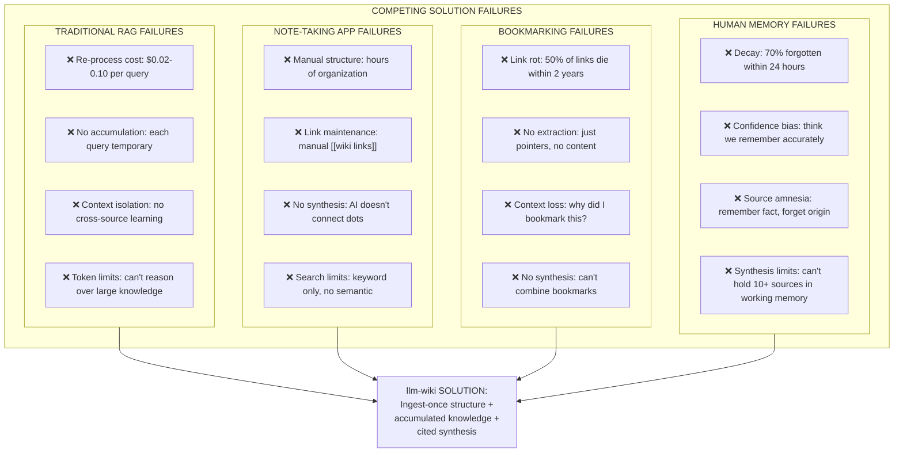

#### Failure Mode Detail: Traditional RAG

| Failure Point | Why It Happens | Customer Pain |
|---------------|----------------|---------------|
| Per-query costs | Re-embeds + generates each time | $50+/month for heavy users |
| Stateless responses | No persistent knowledge structure | Same questions, no learning |
| Token limitations | Context window constraints | Complex queries fail |
| No cross-pollination | Each query isolated | Miss connections between sources |
| Source transparency | Often unclear what sources used | Can't verify claims |

#### Failure Mode Detail: Manual Note-Taking (Notion, Obsidian vanilla)

| Failure Point | Why It Happens | Customer Pain |
|---------------|----------------|---------------|
| High structural burden | User must create system from scratch | Abandoned systems (70% failure rate) |
| Manual linking | Requires remembering to create links | Sparse connections, orphan notes |
| No automated synthesis | Human must connect ideas across notes | Cognitive overload, missed insights |
| Search limitations | Keyword-only or basic search | Can't find when need it |
| Format inconsistency | No enforced standards | Incoherent knowledge base |

#### Failure Mode Detail: Bookmarking (Browser, Pocket, Raindrop)

| Failure Point | Why It Happens | Customer Pain |
|---------------|----------------|---------------|
| Link rot | Websites change, die | 50% bookmarks lead nowhere |
| Storage-only | Links don't extract content | Re-visit site for any detail |
| Context amnesia | Bookmarks lack notes | Forget why something mattered |
| No synthesis | Bookmarks are isolated buckets | Can't combine knowledge |
| Discovery failure | Folder-based organization | Can't find relevant bookmarks |

---

### 5.5 Technical & Implementation Gaps

Current limitations in llm-wiki that may hinder job completion:

| Gap Area | Current Limitation | Customer Impact | Mitigation |
|----------|-------------------|-----------------|------------|
| **Mobile Access** | CLI-only, no mobile app | Can't capture on mobile devices | Web editor partial workaround |
| **Real-time Sync** | File-based, no cloud sync | Multi-device friction | Git-based workflow required |
| **Visual Navigation** | Text-only, no graph view | Hard to see concept relationships | Backlinks + index as workaround |
| **Embedding Search** | Keyword-based relevance | May miss semantic matches | Top-N keyword matching used |
| **Collaboration** | Single-user assumption | Can't share knowledge base | Git + Markdown enables manual sharing |
| **LLM Reliability** | JSON parsing failures possible | Operations may fail | jsonrepair library mitigates |
| **Large Scale** | Keyword search O(n) | Performance degradation at 10k+ pages | Future: vector search on roadmap |
| **Multimedia** | Text sources only | Can't ingest PDFs, videos, audio | Convert to text externally |

---

### 5.6 Opportunity Summary: Where to Invest


Based on gap analysis, priority investment areas for product development:


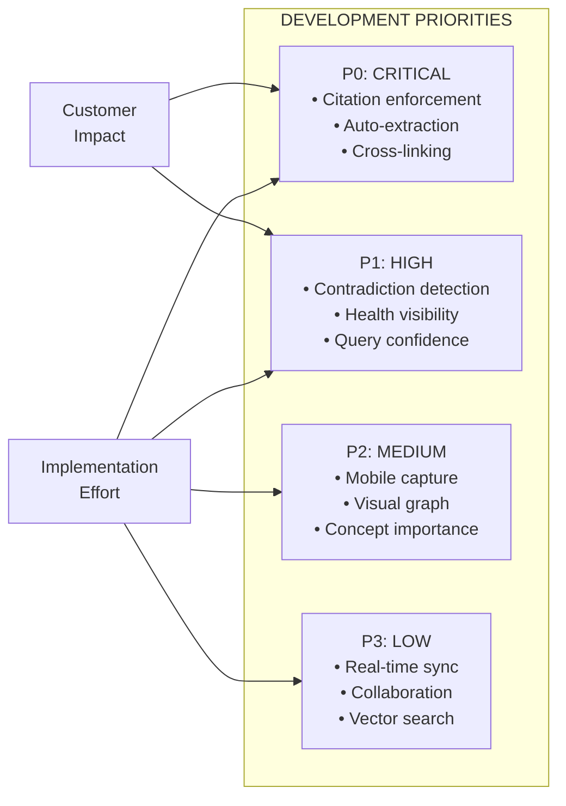

#### Immediate Gaps to Address (P0)

1. **Citation Gap** → Ensure every claim has `[src]` attribution
   - Status: ✅ Implemented
   - Risk: LLM may forget; need validation

2. **Extraction Gap** → Fully automated concept extraction
   - Status: ✅ Implemented via `wiki ingest`
   - Risk: Quality varies by source complexity

3. **Linking Gap** → Automatic cross-concept connections
   - Status: ✅ Implemented with keyword matching
   - Risk: May miss semantic relationships

#### Near-Term Gaps (P1)

1. **Confidence Scoring** → Add confidence indicators to claims
   - Status: ❌ Not implemented
   - Opportunity: High-value differentiator

2. **Query Failure Mode** → Graceful "I don't know" responses
   - Status: ⚠️ Partial (iterations limited to 4)
   - Risk: Overconfident answers with limited data

3. **Health Dashboard** → Visual knowledge base health metrics
   - Status: ⚠️ CLI output only
   - Opportunity: Better visibility

#### Future Gaps (P2/P3)

1. **Mobile Experience** → Native mobile capture
2. **Visual Graph** → Network visualization of concepts
3. **Embeddings** → Semantic similarity search
4. **Real-time Sync** → Cloud-based synchronization

---

## 6. Outcome Hierarchy

The outcome hierarchy shows how desired outcomes map to the overall value proposition.

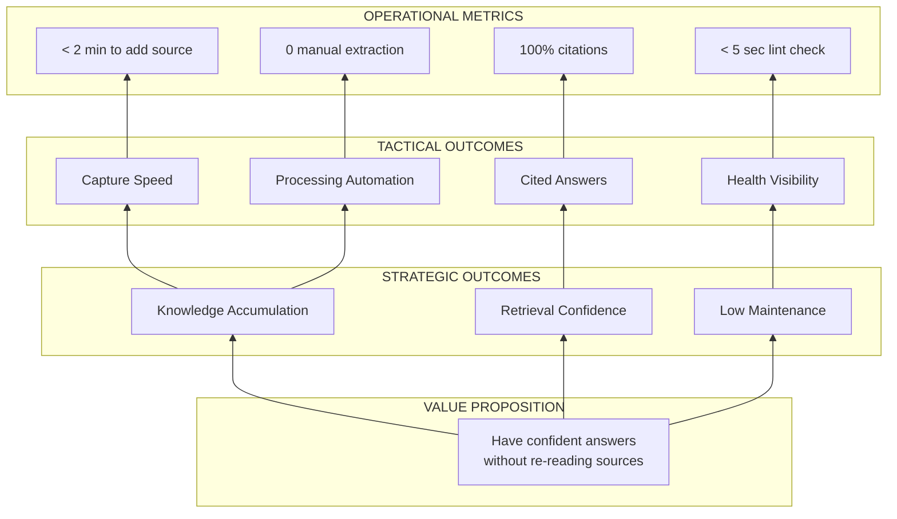

### Outcome Priority Matrix

| Outcome | Importance (1-10) | Current Satisfaction (1-10) | Gap | llm-wiki Impact |
|---------|-------------------|----------------------------|-----|-----------------|
| Have cited answers | 10 | 3 | 7 | High |
| Never re-read same source | 9 | 2 | 7 | High |
| Automatic concept extraction | 9 | 2 | 7 | High |
| Cross-source synthesis | 8 | 3 | 5 | High |
| Contradiction detection | 7 | 1 | 6 | Medium |
| Knowledge health visibility | 6 | 2 | 4 | Medium |
| Automatic organization | 5 | 4 | 1 | Low |

**Priority Quadrant:**
- **High Impact, Low Satisfaction:** Cited answers, No re-reading, Auto-extraction
- **High Impact, Medium Satisfaction:** Cross-source synthesis
- **Medium Impact, Low Satisfaction:** Contradiction detection
- **Medium Impact, Low Satisfaction:** Health visibility

---

## 7. Customer Decision Criteria

When evaluating solutions for the Core Job, customers consider:

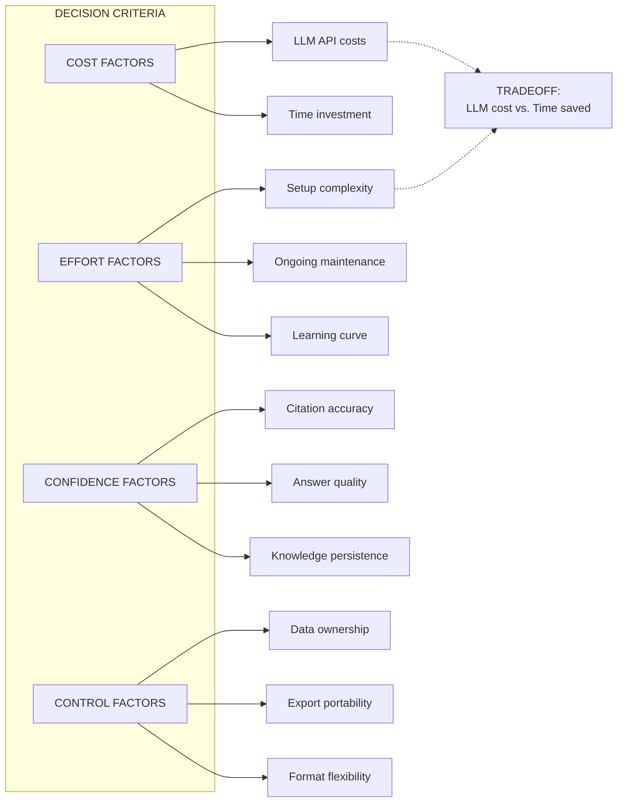

### Decision Criteria Weights (Estimated)

| Criterion | Weight | llm-wiki Position |
|-----------|--------|-------------------|
| Data ownership (no vendor lock-in) | 9 | ✅ Pure Markdown |
| Cited, verifiable answers | 9 | ✅ [src] syntax mandatory |
| Low setup effort | 7 | ✅ Single CLI command |
| API cost efficiency | 7 | ✅ Pay once (ingest), query infinite |
| Answer quality | 8 | ✅ Multi-step agent, synthesis |
| Export portability | 6 | ✅ Standard Markdown |
| Maintenance effort | 6 | ✅ Automated lint |
| Learning curve | 5 | ⚠️ CLI-based, technical users |

---

## 8. Functional, Emotional & Social Jobs

## 8.1 Job Types Breakdown

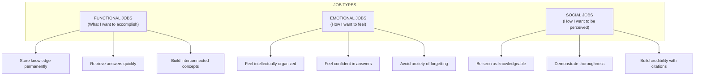

## 8.2 Emotional Jobs

> **"When managing my knowledge, I want to feel intellectually organized and confident, so I can reduce anxiety about forgetting important information and trust my ability to synthesize insights."**

Emotional Outcomes:
- Feel "on top of" my domain knowledge
- Avoid FOMO (fear of missing out) on important sources
- Experience satisfaction of accumulated wisdom
- Maintain confidence in answer accuracy

## 8.3 Social Jobs

> **"When sharing knowledge, I want to be perceived as thorough and credible, so I can build authority and trustworthiness with my audience."**

Social Outcomes:
- Demonstrate wide-ranging research through citations
- Show intellectual honesty (mark contradictions)
- Build reputation as expert through accumulated knowledge
- Facilitate knowledge sharing (Markdown portability)

---

## 9. Switching Criteria

When do customers "fire" their current solution and "hire" llm-wiki?

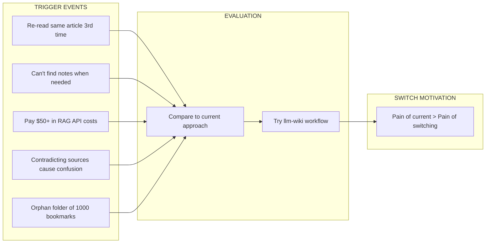

### Switching Triggers

| Trigger Event | Current Approach | Switch Point |
|---------------|----------------|--------------|
| Realizing you re-read the same source 3+ times | Bookmarking, Google | High likelihood |
| Can't find notes when client asks question | Notion, Obsidian | High likelihood |
| $50+ monthly API bill for RAG queries | Traditional RAG | Very high likelihood |
| Discovering contradictory sources without resolution | Simple reading | Medium likelihood |
| Growing anxiety about "losing" important insights | Memory, scattered notes | High likelihood |

---

## 10. Summary: JTBD Framework for llm-wiki

### The Complete Job Statement

```
┌─────────────────────────────────────────────────────────────────────────┐
│                           CORE JOB                                      │
│                                                                         │
│  "When I encounter valuable information from articles, conversations,   │
│   books, or notes, I want to permanently integrate it into a          │
│   structured, interconnected knowledge system, so I can retrieve      │
│   synthesized, cited answers to complex questions without having      │
│   to re-process the original sources."                                  │
│                                                                         │
├─────────────────────────────────────────────────────────────────────────┤
│                      FUNCTIONAL ELEMENTS                                │
│                                                                         │
│   CAPTURE  →  STRUCTURE  →  ACCUMULATE  →  RETRIEVE                     │
│                                                                         │
├─────────────────────────────────────────────────────────────────────────┤
│                    KEY DESIRED OUTCOMES                               │
│                                                                         │
│   ✅ Minimize time from reading to persisted knowledge                  │
│   ✅ Eliminate repeated processing of same sources                      │
│   ✅ Ensure all answers cite specific sources                             │
│   ✅ Maximize automatic cross-concept linking                           │
│   ✅ Detect and resolve contradictions                                  │
│   ✅ Maintain knowledge health automatically                              │
│                                                                         │
├─────────────────────────────────────────────────────────────────────────┤
│                    PRIMARY COMPETITORS                                  │
│                                                                         │
│   Traditional RAG • Google Search • Simple Notes • Bookmarks • Memory │
│                                                                         │
├─────────────────────────────────────────────────────────────────────────┤
│              WHY CUSTOMERS SWITCH (PRIMARY GAINS)                       │
│                                                                         │
│   Pay once (ingest), query infinite • Cited answers • No vendor lock-in │
│   Automatic structure • Growing intelligence over time                │
│                                                                         │
└─────────────────────────────────────────────────────────────────────────┘
```

### Value Proposition Alignment

| User Need | How llm-wiki Addresses It |
|-----------|---------------------------|
| Don't re-read sources | Ingest once, query infinitely |
| Trust my answers | Mandatory `[src: path]` citations |
| Own my data | Pure Markdown, no proprietary format |
| Discover connections | Automatic linking during ingestion |
| Resolve contradictions | Blockquote notation for conflicts |
| Low maintenance | Automated health linting |
| Cost efficiency | Ingestion has cost, queries are free |
| Work with any editor | Standard Markdown + wiki links |

---

## 11. Appendix: JTBD Interview Questions

For validation of this framework, interview customers with:

### 11.1 Job Discovery Questions
1. "Tell me about the last time you needed to find information you knew you had read before. What did you do?"
2. "What frustrates you most about how you currently manage knowledge from articles, books, or conversations?"
3. "When you're researching a topic, how do you keep track of what you've learned?"
4. "Tell me about a time you re-read an article only to realize you'd already read it."

### 11.2 Outcome Validation Questions
5. "How important is it that answers cite specific sources? Why?"
6. "How much would you pay to never re-read the same article twice?"
7. "What would 'perfect' knowledge management look like for you?"

### 11.3 Switching Trigger Questions
8. "What made you decide to try a new approach this time?"
9. "What were you using before? What made you look for something else?"
10. "If you couldn't use llm-wiki tomorrow, what would you go back to?"

---

**Document End**

*This JTBD analysis was derived from comprehensive source code analysis and represents the jobs that llm-wiki is designed to accomplish for knowledge workers.*