# Technical Architecture Documentation

## LLM-Wiki: Personal Knowledge Management System

**Version:** 1.0  
**Date:** April 2025  
**Architecture Type:** Layered CLI Application  
**Primary Language:** TypeScript  
**Runtime:** Node.js 22+

---

## Table of Contents

1. [Architecture Overview](#1-architecture-overview)
2. [System Architecture Diagram](#2-system-architecture-diagram)
3. [Component Overview](#3-component-overview)
4. [Use Cases](#4-use-cases)
5. [Technology Stack](#5-technology-stack)
6. [Key Design Decisions](#6-key-design-decisions)
7. [Detailed Component Documentation](#7-detailed-component-documentation)
8. [File Structure Documentation](#8-file-structure-documentation)
9. [Data Flow Diagrams](#9-data-flow-diagrams)
10. [Deployment Architecture](#10-deployment-architecture)
11. [Security Considerations](#11-security-considerations)
12. [Performance Characteristics](#12-performance-characteristics)

---

## 1. Architecture Overview

### 1.1 High-Level Architecture

LLM-Wiki follows a **layered architecture pattern** with clean separation of concerns. The system is organized into distinct horizontal layers, each with specific responsibilities:

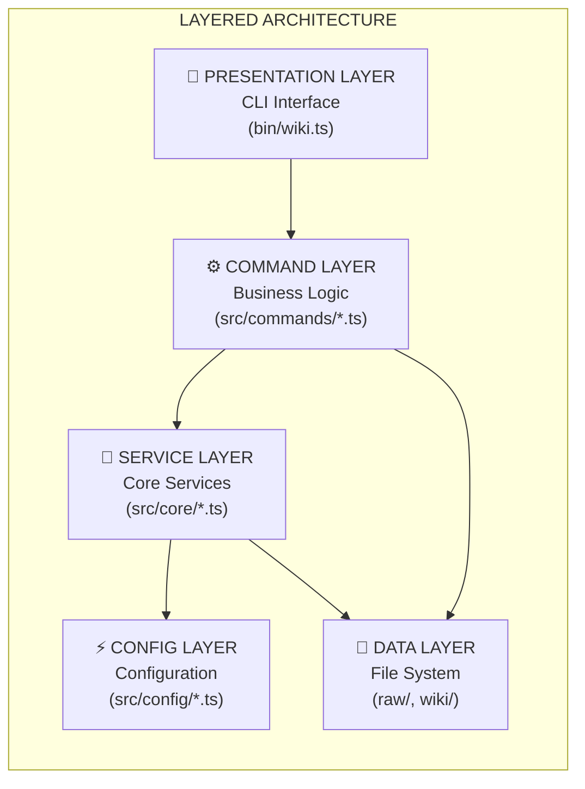

### 1.2 Architectural Pattern: Command Pattern

The CLI commands implement the **Command Pattern**, where each command is encapsulated as an object with:
- **Command Interface:** Consistent function signature
- **Receiver Objects:** WikiManager, LLMClient, PromptBuilder
- **Invoker:** The Commander.js framework
- **Client:** Users invoking CLI commands

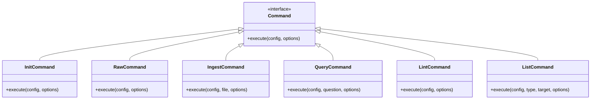

### 1.3 Architectural Pattern: Repository Pattern

The `WikiManager` implements the **Repository Pattern**, abstracting file system operations:
- **Data Access Abstraction:** Hides file system details
- **CRUD Operations:** Create, Read, Update, Delete for wiki pages
- **Query Interface:** Find relevant pages by content

### 1.4 Architectural Pattern: Template Method Pattern

LLM prompts use the **Template Method Pattern** with Handlebars:
- **Base Template:** Agent schema and structure
- **Concrete Templates:** Ingest, Query, Lint specific prompts
- **Template Compilation:** Runtime template rendering

---

## 2. System Architecture Diagram

### 2.1 Complete System Overview

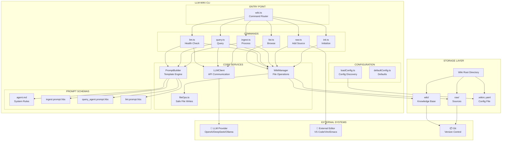

### 2.2 Component Relationships

```mermaid
graph LR
    subgraph Interfaces["CONTRACTS & TYPES"]
        Types["types/index.ts\nConfig, Operations"]
    end
    
    subgraph CoreLayer["CORE LAYER"]
        WM["WikiManager"]
        LC["LLMClient"]
        PB["PromptBuilder"]
        FileOps["fileOps"]
    end
    
    subgraph CommandLayer["COMMAND LAYER"]
        Ingest["ingest"]
        Query["query"]
        Lint["lint"]
        Raw["raw"]
    end
    
    subgraph ExternalLayer["EXTERNAL"]
        FS["File System"]
        API["LLM API"]
        Templates["Handlebars\nTemplates"]
    end
    
    Types -.->|"Implements"| WM
    Types -.->|"Implements"| LC
    
    WM -->| "Uses" | FileOps
    WM -->| "Reads/Writes" | FS
    LC -->| "Calls" | API
    PB -->| "Compiles" | Templates
    
    Ingest -->| "Uses" | WM
    Ingest -->| "Uses" | LC
    Ingest -->| "Uses" | PB
    
    Query -->| "Uses" | WM
    Query -->| "Uses" | LC
    Query -->| "Uses" | PB
    
    Lint -->| "Uses" | WM
    Lint -->| "Uses" | LC
    Lint -->| "Uses" | PB
```

---

## 3. Component Overview

### 3.1 Component Inventory

| Component | Responsibility | Pattern | File(s) |
|-----------|---------------|---------|---------|
| **CLI Entry** | Command routing, argument parsing | Command Pattern | `bin/wiki.ts` |
| **Init Command** | Wiki initialization | Command | `src/commands/init.ts` |
| **Raw Command** | Source capture | Command | `src/commands/raw.ts` |
| **Ingest Command** | LLM-powered processing | Command | `src/commands/ingest.ts` |
| **Query Command** | Multi-step agent | Command + ReAct Pattern | `src/commands/query.ts` |
| **Lint Command** | Health validation | Command | `src/commands/lint.ts` |
| **List Command** | Browse/explore | Command | `src/commands/list.ts` |
| **WikiManager** | File operations, indexing | Repository Pattern | `src/core/wikiManager.ts` |
| **LLMClient** | API communication | Adapter Pattern | `src/core/llmClient.ts` |
| **PromptBuilder** | Template compilation | Template Method | `src/core/promptBuilder.ts` |
| **Config Loader** | Configuration discovery | Strategy Pattern | `src/config/loadConfig.ts` |

### 3.2 Component Responsibilities

#### WikiManager
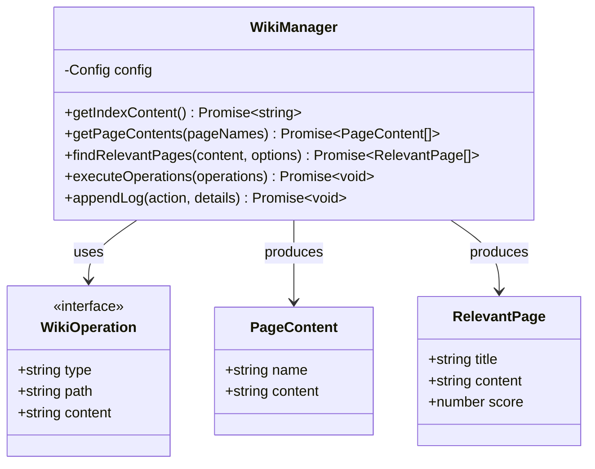

#### LLMClient
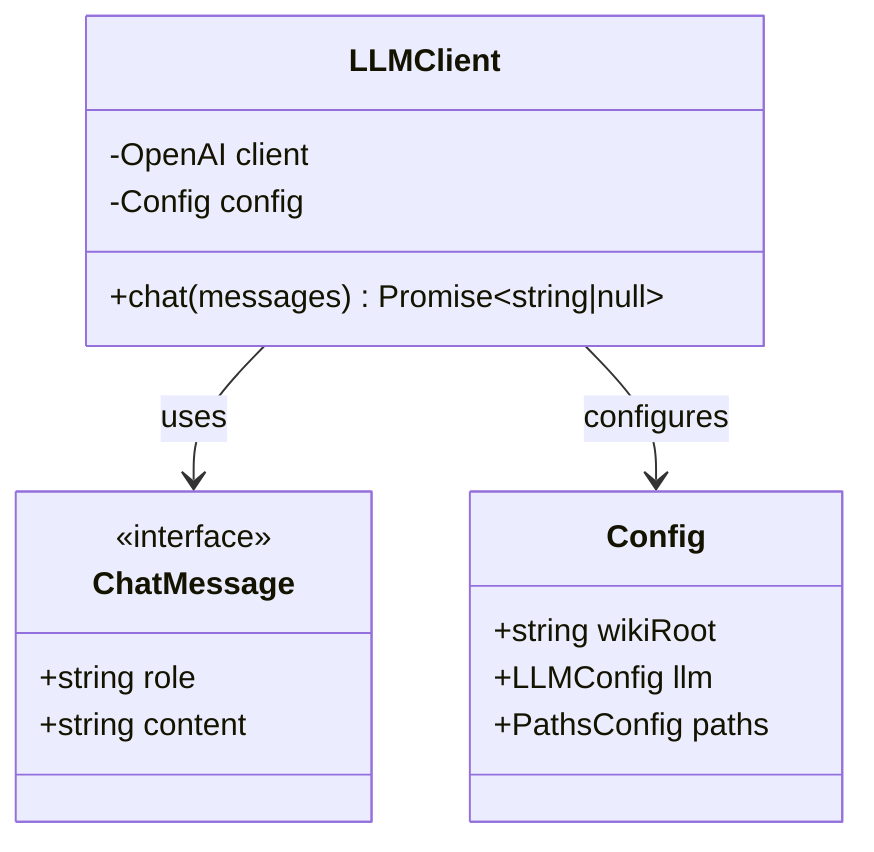

---

## 4. Use Cases

### 4.1 Use Case: Initialize Wiki

**Primary Actor:** User  
**Goal:** Set up a new wiki directory structure  
**Preconditions:** Node.js 22+ installed, CLI installed  
**Trigger:** User runs `wiki init`

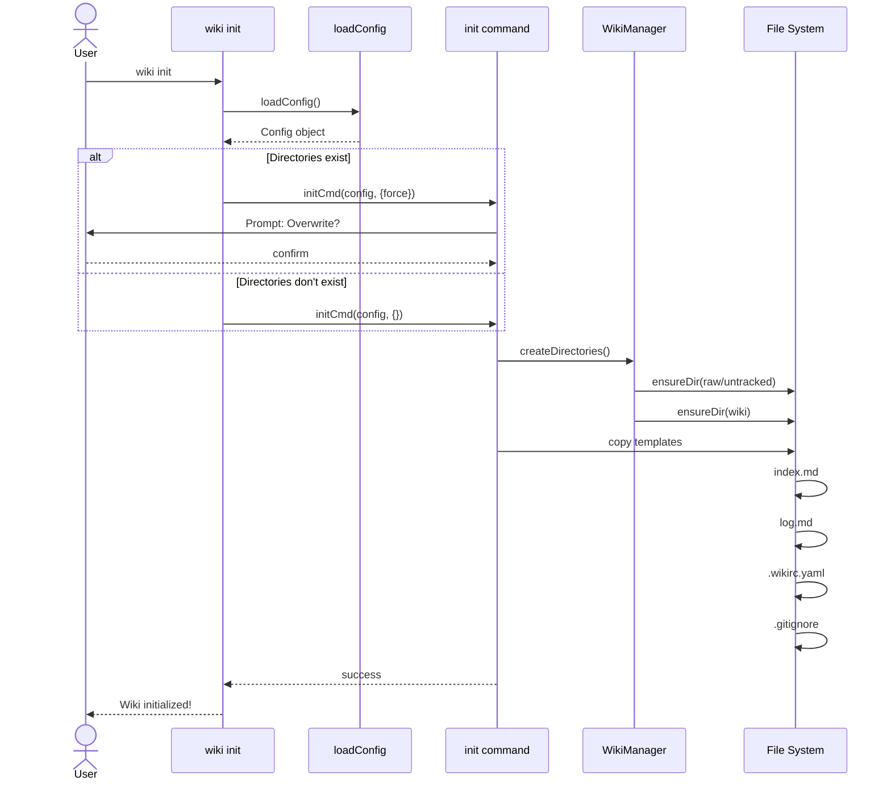

**Postconditions:**
- Directory structure created
- Template files copied
- Config file ready for editing

---

### 4.2 Use Case: Add Raw Source

**Primary Actor:** User  
**Goal:** Capture a new information source  
**Preconditions:** Wiki initialized  
**Trigger:** User encounters valuable information

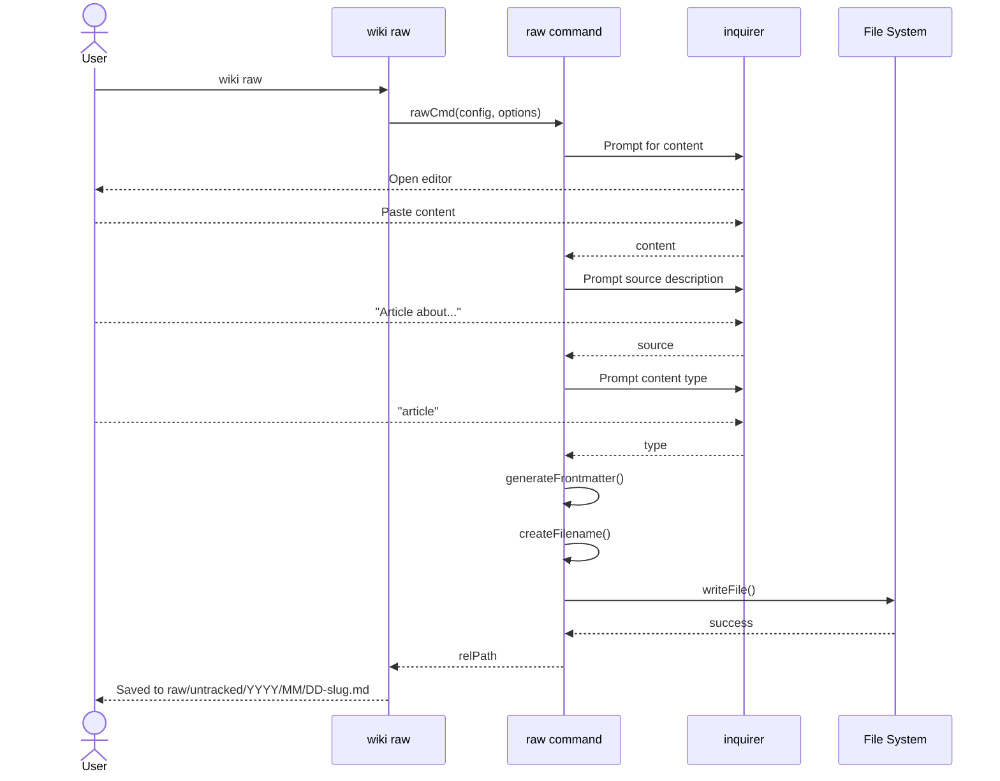

**Postconditions:**
- Markdown file saved with YAML frontmatter
- File in untracked status
- Ready for ingestion

---

### 4.3 Use Case: Ingest Sources

**Primary Actor:** User  
**Goal:** Process raw sources into wiki knowledge  
**Preconditions:** Raw sources exist  
**Trigger:** User runs `wiki ingest`

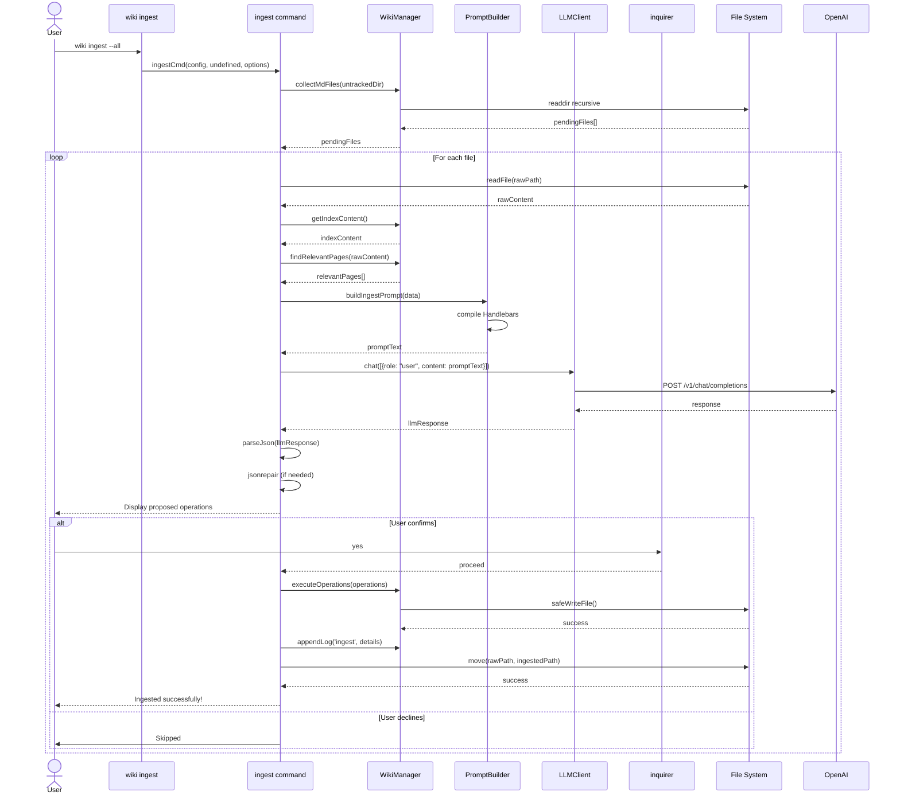

**Postconditions:**
- Wiki pages created/updated
- Index updated
- Source moved to ingested/
- Operation logged

---

### 4.4 Use Case: Query Wiki

**Primary Actor:** User  
**Goal:** Get synthesized answer from knowledge base  
**Preconditions:** Wiki has ingested sources  
**Trigger:** User has a question

```mermaid
sequenceDiagram
    actor User
    participant CLI as wiki query
    participant Query as query command
    participant WM as WikiManager
    participant PB as PromptBuilder
    participant LC as LLMClient
    participant Inquirer as inquirer
    
    User->>CLI: wiki query "How to...?"
    CLI->>Query: queryCmd(config, question, options)
    
    Query->>WM: getIndexContent()
    WM-->>Query: indexContent
    
    Query->>Query: loadedPages = []
    Query->>Query: iteration = 0
    
    loop Max 4 iterations
        Query->>Query: iteration++
        
        Query->>PB: buildQueryAgentPrompt(data)
        PB-->>Query: promptText
        
        Query->>LC: chat([{role: "user", content}])
        LC-->>Query: response
        
        Query->>Query: parseJson(response)
        
        alt action == "read"
            Query->>Query: actionData.pages[]
            Query->>User: Agent wants to read: pages
            Query->>WM: getPageContents(pages)
            WM-->>Query: newPages[]
            Query->>Query: loadedPages.push(newPages)
            Note over Query: Continue to next iteration
        else action == "answer"
            Query-->>Query: actionData.content
            break
        end
    end
    
    Query->>User: Display synthesized answer
    Query->>WM: appendLog('query', details)
    
    alt User wants to save
        Query->>Inquirer: Save to wiki?
        User-->>Inquirer: yes
        Inquirer-->>Query: save = true
        
        Query->>Query: promptForPageName()
        Query->>WM: executeOperations([create answer])
        WM-->>Query: success
        Query->>User: "Saved to wiki/answers/"
    end
```

**Postconditions:**
- Answer displayed to user
- Optionally saved to wiki/answers/
- Query logged

---

### 4.5 Use Case: Health Check (Lint)

**Primary Actor:** User  
**Goal:** Validate wiki integrity  
**Preconditions:** Wiki has content  
**Trigger:** Periodic maintenance or suspicion of issues

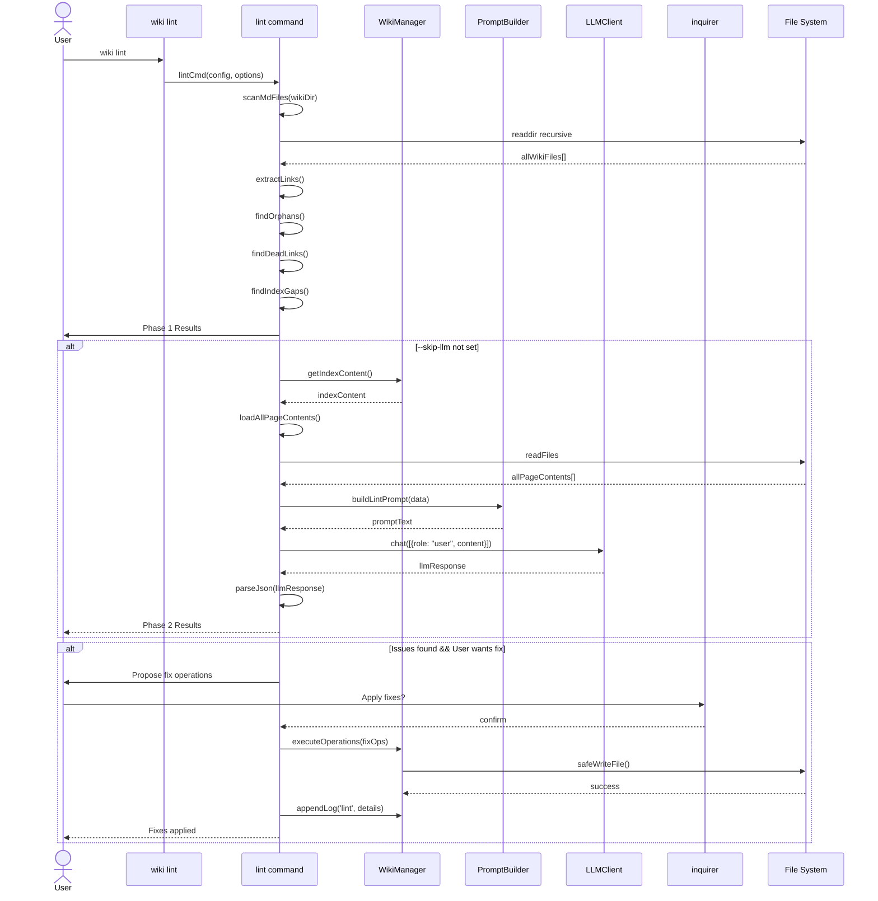

**Postconditions:**
- Orphan pages identified
- Dead links detected
- Contradictions flagged
- Fixes optionally applied

---

## 5. Technology Stack

### 5.1 Complete Technology Inventory

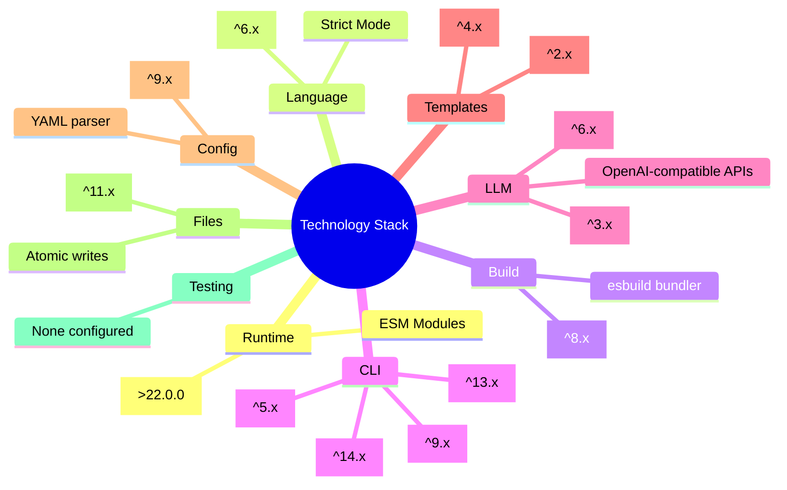

### 5.2 Technology Selection Rationale

| Technology | Purpose | Why Selected |
|------------|---------|--------------|
| **Node.js 22+** | Runtime | Native ESM support, stable APIs |
| **TypeScript** | Language | Type safety, IDE support, maintainability |
| **tsup** | Bundler | Fast builds, TypeScript native, minimal config |
| **Commander** | CLI Framework | Industry standard, feature-rich, stable |
| **OpenAI SDK** | LLM Integration | De facto standard, provider flexibility |
| **Handlebars** | Templating | Logic-less templates, precompilation possible |
| **cosmiconfig** | Config Discovery | Supports multiple formats, standard approach |
| **Inquirer** | Interactive Prompts | Rich prompts, validation, user-friendly |

### 5.3 Dependency Categories

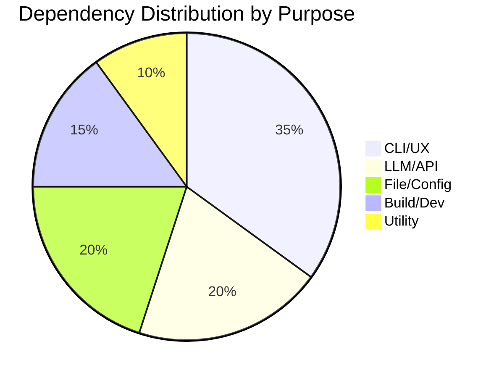

---

## 6. Key Design Decisions

### 6.1 Architecture Decisions

#### DD-1: Layered Architecture over Microservices
**Decision:** Use monolithic layered architecture
**Rationale:** 
- Single-user tool, no need for distributed systems
- Simpler deployment and maintenance
- File-system based, no service boundaries

#### DD-2: File System over Database
**Decision:** Use Markdown files instead of database
**Rationale:**
- Zero vendor lock-in (pure Markdown)
- Works with any text editor (Obsidian, VS Code)
- Git-friendly for version control
- Human-readable and editable

**Trade-offs:**
- Query performance (O(n) file scan)
- No ACID transactions
- Limited concurrent access
- Mitigation: Atomic file writes, future roadmap includes vector search

#### DD-3: ReAct Agent for Query
**Decision:** Implement multi-step ReAct pattern
**Rationale:**
- LLMs have limited context windows
- Progressive retrieval allows deeper reasoning
- User sees agent "thinking" (transparency)
- Can dive into source files for detailed answers

**Algorithm:**
```
maxIterations = 4
loadedPages = []

for i in 1..maxIterations:
    prompt = buildPrompt(question, index, loadedPages)
    response = llm.chat(prompt)
    action = parse(response)
    
    if action.type == "read":
        newPages = loadPages(action.pages)
        loadedPages.extend(newPages)
    elif action.type == "answer":
        return action.content
```

#### DD-4: Repository Pattern for File Operations
**Decision:** Abstract file system through WikiManager
**Rationale:**
- Centralized error handling
- Path validation (security)
- Easier testing (can mock)
- Consistent API for commands

#### DD-5: Template-Based Prompts
**Decision:** Use Handlebars templates for LLM prompts
**Rationale:**
- Separation of prompt structure from data
- Schema files can be edited without code changes
- Reusable templates across commands
- Type-safe data injection

#### DD-6: Configuration Management
**Decision:** Use cosmiconfig with YAML
**Rationale:**
- Multiple config format support (JSON, YAML, JS)
- Standard configuration discovery
- Environment variable fallback
- `.wikirc.yaml` auto-gitignored for API key protection

### 6.2 Data Flow Decisions

#### DD-7: Atomic File Writes
**Decision:** Use temp file + rename pattern
**Implementation:**
```typescript
async function safeWriteFile(filePath, content):
    tempPath = filePath + ".tmp." + timestamp
    await fs.writeFile(tempPath, content)
    await fs.rename(tempPath, filePath)
```
**Rationale:** Prevents data corruption on crash/interruption

#### DD-8: Mandatory Source Citations
**Decision:** Enforce `[src: path]` syntax in LLM prompts
**Rationale:**
- Trust and verifiability
- Academic integrity
- Can trace back to original sources
- Distinguishes synthesis from hallucination

### 6.3 Security Decisions

#### DD-9: Path Traversal Protection
**Decision:** Validate all paths against wiki root
**Implementation:**
```typescript
if (!absolutePath.startsWith(path.resolve(wikiRoot))):
    throw new Error("Path traversal detected")
```

#### DD-10: API Key Isolation
**Decision:** Store in `.wikirc.yaml` (gitignored)
**Rationale:**
- Prevents accidental commit of secrets
- User can use env var fallback
- Template shows placeholder value

### 6.4 Trade-off Summary

```mermaid
quadrantChart
    title Design Trade-offs
    x-axis Low Complexity -> High Complexity
    y-axis Lower Quality -> Higher Quality
    
    "File System over DB[20,40]": 1
    "CLI over GUI[30,60]": 2
    "Markdown over Rich Text[20,70]": 3
    "ReAct over Single-Prompt[60,80]": 4
    "Local over Cloud[40,90]": 5
    "Keyword over Vector Search[50,50]": 6
```

---

## 7. Detailed Component Documentation

### 7.1 Core Components

#### WikiManager (`src/core/wikiManager.ts`)

**Responsibility:** Central hub for all wiki file operations

**Class Diagram:**

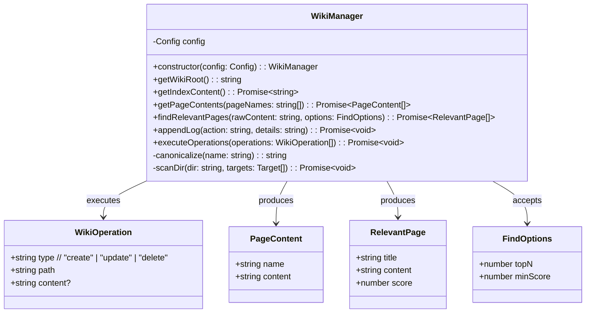

**Key Algorithms:**

1. **Relevant Page Discovery (Keyword Scoring):**
```
Input: rawContent, existingWikiFiles
1. Extract words (>3 chars) from rawContent, excluding stop words
2. For each .md file in wiki:
   a. Count keyword matches in content (+1 per match)
   b. Count keyword matches in filename (+3 per match, higher weight)
   c. Sum = total score
3. Filter by minScore threshold
4. Sort by score descending
5. Return topN results
Time Complexity: O(n × m) where n = files, m = content length
```

2. **Page Discovery by Name:**
```
Input: pageNames[]
1. Canonicalize each name (lowercase, alphanumeric only)
2. For each file in wiki/ and raw/ingested/:
   a. Canonicalize filename
   b. Check exact match first
   c. Check substring match (with safety constraints)
3. Return matched pages
```

3. **Atomic Operations Execution:**
```
Input: operations[]
For each operation:
    1. Validate path (must be within wikiRoot)
    2. If create/update:
       - Ensure parent directory exists
       - Create temp file
       - Write content to temp
       - Rename temp to target (atomic)
    3. If delete:
       - fs.remove(path)
```

---

#### LLMClient (`src/core/llmClient.ts`)

**Responsibility:** Abstract LLM API communication

**Class Diagram:**

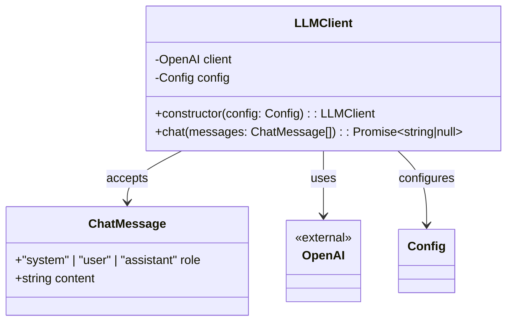

**API Contract:**
```typescript
interface ChatMessage {
    role: 'system' | 'user' | 'assistant';
    content: string;
}

async chat(messages: ChatMessage[]): Promise<string | null>
// Returns: LLM response content or null on failure
// Throws: OpenAI API errors
```

**Configuration:**
- `config.llm.apiKey` - Authentication
- `config.llm.baseUrl` - Provider endpoint (supports proxies)
- `config.llm.model` - Model name (gpt-4o, deepseek-chat, etc.)
- `config.llm.temperature` - Creativity vs determinism
- `config.llm.thinking` - Reasoning model support (o1, o3)

**Error Handling:**
- Network errors bubble up to command layer
- Empty responses return null
- Rate limiting handled by OpenAI SDK

---

#### PromptBuilder (`src/core/promptBuilder.ts`)

**Responsibility:** Compile LLM prompts from templates and data

**Class Diagram:**

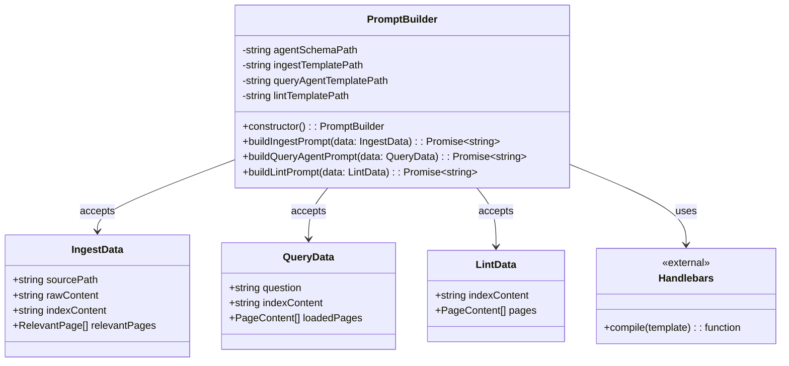

**Template Strategy:**
1. Load system schema (`agent.md`) - universal rules
2. Load command-specific template (.hbs)
3. Compile with Handlebars
4. Inject data
5. Return final prompt string

**Template Structure:**
```
{{agentSystemPrompt}}  ← Universal rules

---

{{commandSpecificContext}}  ← Data injection
```

---

#### File Operations (`src/core/fileOps.ts`)

**Responsibility:** Atomic file system operations

**Function:**
```typescript
async function safeWriteFile(
    filePath: string, 
    content: string
): Promise<void>
```

**Algorithm:**
```mermaid
flowchart TD
    A[Start] --> B[Extract directory from path]
    B --> C[Ensure directory exists]
    C --> D[Generate temp path: path.tmp.timestamp]
    D --> E[Write content to temp file]
    E --> F{Rename to target}
    F -->| "Success" | G[End]
    F -->| "Failure" | H[Delete temp file]
    H --> I[Throw error]
    I --> J[End]
```

**Atomicity Guarantee:**
- File system rename is atomic on POSIX/Windows
- Readers see either old or new content, never partial
- Crash-safe: temp files may remain but don't corrupt target

---

### 7.2 Configuration Components

#### Config Loader (`src/config/loadConfig.ts`)

**Responsibility:** Discover and merge configuration from multiple sources

**Configuration Precedence (highest to lowest):**
1. `.wikirc.yaml` (project-specific)
2. `.wikirc.json`
3. `package.json` (wiki key)
4. Default configuration

**Mermaid Flow:**
```mermaid
flowchart LR
    A[Config Request] --> B[cosmiconfig search]
    B --> C{Config Found?}
    C -->| "Yes" | D[Parse Config]
    C -->| "No" | E[Use Defaults]
    D --> F[Merge with Defaults]
    E --> G[Return Config]
    F --> G
```

**Merge Strategy:**
```javascript
return {
    ...defaultConfig,
    ...foundConfig,
    llm: { ...defaultConfig.llm, ...foundConfig.llm },
    paths: { ...defaultConfig.paths, ...foundConfig.paths }
};
```

**Environment Variable Fallback:**
```typescript
const apiKey = config.llm.apiKey || process.env.OPENAI_API_KEY;
```

#### Default Config (`src/config/defaultConfig.ts`)

**Default Values:**
```yaml
wikiRoot: "."
llm:
  provider: openai
  model: gpt-4o
  temperature: 0.3
  thinking: { type: disabled }
paths:
  raw: raw
  wiki: wiki
  templates: templates
```

---

### 7.3 Command Components

#### Command Interface Contract

All commands implement the same interface:
```typescript
type CommandFunction = (
    config: Config,
    ...args: any[]
) => Promise<void>;
```

Mermaid showing command execution flow:
```mermaid
flowchart TB
    subgraph Commands{
        Init["init.ts\nInitialize wiki structure"]
        Raw["raw.ts\nCapture source"]
        Ingest["ingest.ts\nProcess with LLM"]
        Query["query.ts\nSearch & answer"]
        Lint["lint.ts\nHealth check"]
        List["list.ts\nBrowse"]
    }
    
    Commands --> Core
    
    subgraph Core{
        WM["WikiManager"]
        LC["LLMClient"]
        PB["PromptBuilder"]
    }
    
    subgraph Dependencies{
        FS["File System"]
        API["LLM API"]
    }
    
    WM --> FS
    LC --> API
```

#### Init Command

**Algorithm:**
1. Check if directories exist
2. If exist and no --force, prompt for overwrite
3. Create raw/untracked, wiki directories
4. Copy templates (index.md, log.md, .wikirc.yaml, .gitignore)
5. Display success message

#### Raw Command

**Algorithm:**
1. Get content (from --content, editor, or stdin)
2. Prompt for source description (if not --source)
3. Prompt for content type (if not --type)
4. Generate frontmatter (YAML)
5. Create filename (date + slug)
6. Ensure YYYY/MM directory structure
7. Handle filename collisions (counter suffix)
8. Write file to raw/untracked/

#### Ingest Command

**Algorithm:**
```mermaid
flowchart TD
    Start --> CollectFiles
    CollectFiles --> SelectFiles
    SelectFiles --> ForEachFile
    
    subgraph FileLoop["For Each File"]
        ReadRaw --> FindRelevant
        FindRelevant --> BuildPrompt
        BuildPrompt --> CallLLM
        CallLLM --> ParseJSON
        ParseJSON --> RepairIfNeeded
        RepairIfNeeded --> DisplayOps
        DisplayOps --> Confirm
        Confirm -->| "Yes" | Execute
        Confirm -->| "No" | Skip
        Execute --> MoveSource
        MoveSource --> Log
    end
    
    ForEachFile --> FileLoop
    Log --> NextFile{More Files?}
    NextFile -->| "Yes" | FileLoop
    NextFile -->| "No" | End
```

**Key Steps:**
1. Collect pending files (recursive .md scan)
2. Allow selection (--all or interactive)
3. For each file:
   - Read content
   - Find relevant existing pages (keyword matching)
   - Build LLM prompt
   - Call LLM
   - Parse operations (with jsonrepair fallback)
   - Display proposed operations
   - Execute if confirmed
   - Move to ingested/
   - Log operation

#### Query Command

**Algorithm:**
```mermaid
flowchart TD
    Start --> GetQuestion
    GetQuestion --> LoadIndex
    LoadIndex --> InitializeLoop
    
    subgraph AgentLoop["ReAct Agent Loop (max 4)"]
        BuildPrompt --> CallLLM
        CallLLM --> ParseAction
        ParseAction --> ActionType{Action?}
        
        ActionType -->| "read" | LoadPages
        LoadPages --> AddToContext
        AddToContext --> ContinueLoop{Continue?}
        
        ActionType -->| "answer" | ExtractAnswer
        ExtractAnswer --> Break
        
        ContinueLoop -->| "Yes" | BuildPrompt
        ContinueLoop -->| "No" | MaxIterations
        MaxIterations --> TimeoutAnswer
    end
    
    InitializeLoop --> AgentLoop
    Break --> DisplayAnswer
    TimeoutAnswer --> DisplayAnswer
    DisplayAnswer --> LogQuery
    LogQuery --> PromptSave
    PromptSave -->| "Yes" | SaveAnswer
    SaveAnswer --> End
    PromptSave -->| "No" | End
```

**ReAct Pattern Implementation:**
```
State: loadedPages = [], iteration = 0

while iteration < 4:
    iteration++
    prompt = buildPrompt(question, index, loadedPages)
    response = llm.chat(prompt)
    action = parse(response)
    
    if action.type == "read":
        newPages = loadPages(action.pages)
        loadedPages.extend(newPages)
        continue
    else if action.type == "answer":
        display(action.content)
        break

display answer
log operation
prompt to save
```

#### Lint Command

**Algorithm:**

**Phase 1: Static Analysis**
1. Scan all .md files in wiki/
2. Extract all [[wiki links]]
3. Find orphans (pages with no incoming links)
4. Find dead links (links to non-existent pages)
5. Find index gaps (pages not in index.md)
6. Display results

**Phase 2: LLM Analysis (if not --skip-llm)**
1. Load all page contents
2. Build lint prompt
3. Call LLM
4. Parse contradictions, missing concepts, shallow pages
5. Display results

**Phase 3: Auto-fix (if --fix or confirmed)**
1. Generate fix operations
2. Create stubs for missing concepts
3. Update index.md
4. Execute operations
5. Log fixes

#### List Command

**Modes:**
- `list raw` - Show untracked + ingested
- `list pages` - Show all wiki pages
- `list orphans` - Show pages with no backlinks
- `list backlinks "Page"` - Show pages linking to target

---

## 8. File Structure Documentation

### 8.1 Project Structure

```mermaid
tree
    root((llm-wiki))
        bin
            wiki.ts
        src
            commands
                init.ts
                lint.ts
                list.ts
                query.ts
                raw.ts
                ingest.ts
            config
                defaultConfig.ts
                loadConfig.ts
            core
                fileOps.ts
                llmClient.ts
                promptBuilder.ts
                wikiManager.ts
            schemas
                agent.md
                ingest.prompt.hbs
                lint.prompt.hbs
                query_agent.prompt.hbs
            types
                index.ts
        templates
            wiki
                index.md
                log.md
            .wikirc.yaml
            _gitignore
        package.json
        tsconfig.json
        tsup.config.ts
```

### 8.2 Runtime Wiki Structure

```mermaid
tree
    root((my-wiki))
        .wikirc.yaml
        .gitignore
        raw
            untracked
                YYYY
                    MM
                        DD-source.md
            ingested
                YYYY
                    MM
                        DD-source.md
        wiki
            index.md
            log.md
            concepts
                topic.md
            answers
                question.md
            sources
                attribution.md
```

### 8.3 File Responsibilities

| File | Type | Responsibility |
|------|------|----------------|
| `bin/wiki.ts` | Entry Point | CLI setup, command registration, routing |
| `src/commands/*.ts` | Commands | Business logic for each CLI command |
| `src/core/wikiManager.ts` | Service | File operations repository |
| `src/core/llmClient.ts` | Service | LLM API adapter |
| `src/core/promptBuilder.ts` | Service | Template engine |
| `src/core/fileOps.ts` | Utility | Atomic file writes |
| `src/config/loadConfig.ts` | Config | Configuration discovery |
| `src/config/defaultConfig.ts` | Config | Default values |
| `src/schemas/*.md` | Schema | System prompts |
| `src/schemas/*.hbs` | Template | Command-specific prompts |
| `src/types/index.ts` | Types | TypeScript interfaces |

---

## 9. Data Flow Diagrams

### 9.1 Ingestion Data Flow

```mermaid
flowchart LR
    subgraph Input
        Raw["Raw Markdown\n(YAML frontmatter)"]
    end
    
    subgraph Process["Ingestion Pipeline"]
        Keyword["Keyword\nExtraction"]
        Match["Relevant Page\nMatching"]
        Prompt["Prompt\nConstruction"]
        LLM["LLM\nProcessing"]
        Parse["JSON\nParsing"]
    end
    
    subgraph Output
        Concepts["Wiki Pages\n(concepts/)"]
        Index["index.md\nUpdated"]
        Log["log.md\nAppended"]
        Ingested["raw/ingested/\nMoved"]
    end
    
    Raw --> Keyword
    Keyword --> Match
    Match --> Prompt
    Prompt --> LLM
    LLM --> Parse
    
    Parse --> Concepts
    Parse --> Index
    Parse --> Log
    Raw -.->| "moved" | Ingested
```

### 9.2 Query Data Flow

```mermaid
flowchart LR
    subgraph Stimulus
        Question["User Question"]
    end
    
    subgraph Agent["ReAct Agent"]
        State["Agent State\n(loadedPages[])"]
        Index["Read Index"]
        Concepts["Read Concepts"]
        Sources["Read Sources"]
        Synthesize["Synthesize Answer"]
    end
    
    subgraph Response
        Answer["Markdown Answer\nwith [src] citations"]
        Optional["Optional:\nSaved to wiki/answers/"]
    end
    
    Question --> Agent
    Index --> State
    State -->| "decide" | Concepts
    Concepts -->| "decide" | Sources
    Sources --> State
    State -->| "decide" | Synthesize
    Synthesize --> Answer
    Answer --> Optional
```

### 9.3 Configuration Data Flow

```mermaid
flowchart TD
    Sources["Config Sources"] --> Load
    
    subgraph Sources
        Env["Environment\n(OPENAI_API_KEY)"]
        Project["Project\n(.wikirc.yaml)"]
        Package["package.json\n(wiki key)"]
        Defaults["Code Defaults"]
    end
    
    Load["cosmiconfig\nloadConfig()"] --> Merge
    
    subgraph Merge["deepMerge"]
        Priority1["1. User Config"]
        Priority2["2. Defaults"]
    end
    
    Merge --> Validate
    Validate["Type Validation"] --> Config["Config Object"]
    
    Config --> CLI
    Config --> Commands
    Config --> Services
```

---

## 10. Deployment Architecture

### 10.1 Runtime Environment

```mermaid
flowchart TB
    subgraph Runtime["Node.js 22+ Runtime"]
        direction TB
        
        subgraph Process["Node Process"]
            CLI["CLI Interface"]
            Core["Core Services"]
            FS["File System Access"]
        end
        
        subgraph External["External Connections"]
            LLM["LLM API\n(HTTPS)"]
            Editor["External Editor\n($EDITOR)"]
        end
    end
    
    subgraph Storage["Local Storage"]
        Files["Markdown Files\n(raw/, wiki/)"]
        Config["Config\n(.wikirc.yaml)"]
    end
    
    CLI --> Core
    Core --> FS
    Core --> LLM
    CLI --> Editor
    FS --> Files
    FS --> Config
```

### 10.2 Distribution

```mermaid
flowchart LR
    subgraph Source
        TS["TypeScript Source"]
    end
    
    subgraph Build["tsup Build"]
        Compile["esbuild Compile"]
        Bundle["Bundle Dependencies"]
        Shebang["Add Shebang"]
        Copy["Copy Schemas"]
    end
    
    subgraph Package["NPM Package"]
        Dist["dist/"]
        Templates["templates/"]
        JSON["package.json"]
    end
    
    TS --> Compile
    Compile --> Bundle
    Bundle --> Shebang
    Shebang --> Copy
    Copy --> Dist
    Dist --> Package
    Templates --> Package
    JSON --> Package
```

### 10.3 Installation Methods

| Method | Command | Use Case |
|--------|---------|----------|
| Global npm | `npm install -g llm-wiki` | System-wide access |
| Global pnpm | `pnpm add -g llm-wiki` | System-wide access |
| Local | `npm install llm-wiki` | Project-specific |
| Development | `git clone && npm link` | Contributors |

---

## 11. Security Considerations

### 11.1 Threat Model

```mermaid
flowchart TD
    subgraph Threats["Threat Vectors"]
        T1["Path Traversal\n(Malicious file paths)"]
        T2["API Key Leak\n(Git commit)"]
        T3["LLM Injection\n(Malicious content)"]
        T4["Local File Access\n(Unprivileged reads)"]
    end
    
    subgraph Mitigations["Mitigations"]
        M1["Path validation\n(must be in wikiRoot)"]
        M2[".gitignore template\nAuto-ignore config"]
        M3["Prompt engineering\n(System constraints)"]
        M4["fs-extra\n(Standard permissions)"]
    end
    
    T1 --> M1
    T2 --> M2
    T3 --> M3
    T4 --> M4
```

### 11.2 Security Controls

| Control | Implementation | File |
|---------|-----------------|------|
| Path Validation | `absolutePath.startsWith(wikiRoot)` | `wikiManager.ts:executeOperations` |
| API Key Protection | `.wikirc.yaml` in `.gitignore` | `templates/_gitignore` |
| Safe File Writes | Temp file + rename | `fileOps.ts` |
| Input Sanitization | YAML parsing, JSON repair | `loadConfig.ts`, `ingest.ts` |
| Prompt Injection Defense | System prompt constraints | `agent.md` |

---

## 12. Performance Characteristics

### 12.1 Time Complexity Analysis

| Operation | Complexity | Notes |
|-----------|-----------|-------|
| Page lookup by name | O(n × m) | n = files, m = filename length |
| Relevant page discovery | O(n × c) | c = content length, keyword matching |
| File write | O(c) | Atomic via temp+rename |
| Index loading | O(1) | Single file read |
| Directory scan | O(n) | Recursive file walk |

### 12.2 Scalability Limits

| Resource | Soft Limit | Hard Limit | Mitigation |
|----------|-----------|------------|------------|
| Wiki pages | 1,000 | File system | Keyword search O(n) |
| Single file size | 1MB | Memory | Streaming not implemented |
| Ingestion batch | 100 | Memory | Iterative processing |
| Query iterations | 4 | Hardcoded | Configurable future |

### 12.3 Bottlenecks

```mermaid
flowchart LR
    subgraph Bottlenecks["Performance Bottlenecks"]
        IO["File I/O\nSynchronous reads"]
        Network["LLM API\nNetwork latency"]
        Search["Keyword Search\nO(n) complexity"]
    end
    
    subgraph Solutions["Future Optimizations"]
        Cache["File Caching"]
        Vector["Vector Search\nEmbeddings"]
        Batch["Batch API Calls"]
    end
    
    IO --> Cache
    Network --> Batch
    Search --> Vector
```

### 12.4 Memory Profile

| Operation | Memory Usage | Peak |
|-----------|-------------|------|
| wiki init | Low | ~10MB |
| wiki raw | Low | ~10MB |
| wiki ingest | Medium | ~50MB (LLM context) |
| wiki query | Medium | ~100MB (multi-step) |
| wiki lint | High | ~200MB (loads all pages) |

---

## 13. Future Architecture Considerations

### 13.1 Roadmap Items

```mermaid
flowchart LR
    subgraph Current["Current"]
        Keyword["Keyword Matching"]
        FileFS["File System Only"]
        Single["Single User"]
    end
    
    subgraph Future["Future"]
        Vector["Vector Search\nEmbeddings"]
        Cloud["Cloud Sync"]
        Multi["Multi-User\nCollaboration"]
        GUI["Web GUI"]
    end
    
    subgraph Bridge["Bridge"]
        Hybrid["Hybrid Search\nKeyword + Vector"]
        GitSync["Git-Based Sync"]
        Share["Export/Share"]
    end
    
    Current --> Bridge
    Bridge --> Future
    Keyword --> Hybrid --> Vector
    FileFS --> GitSync --> Cloud
    Single --> Share --> Multi
```

### 13.2 Architectural Evolution

| Phase | Focus | Changes |
|-------|-------|---------|
| Current | Stability | Bug fixes, robustness |
| Near-term | Scale | Vector search, caching |
| Medium-term | Collaboration | Multi-user, sync |
| Long-term | Ecosystem | Plugins, integrations |

---

## Appendix: Glossary

| Term | Definition |
|------|------------|
| **ReAct** | Reasoning + Acting pattern for LLM agents |
| **Repository Pattern** | Abstraction layer for data access |
| **Command Pattern** | Encapsulate commands as objects |
| **Template Method** | Define algorithm skeleton, subclasses override steps |
| **Atomic Write** | Write that completes entirely or not at all |
| **Frontmatter** | YAML metadata section in Markdown files |
| **Wiki Link** | `[[Page Title]]` syntax for internal linking |
| **Orphan Page** | Page with no incoming links |
| **Dead Link** | Link pointing to non-existent page |

---

**Document End: Technical Architecture Documentation**

*This architecture document provides comprehensive technical documentation for the llm-wiki system, including component details, design decisions, and implementation patterns.*