# Source Code File Documentation

## LLM-Wiki: Detailed File Specifications

---

## File: `bin/wiki.ts`

### Overview
**Purpose:** CLI entry point and command router  
**Type:** Entry Point Module  
**Lines:** ~60

### Responsibilities
1. Parse command-line arguments using Commander.js
2. Load configuration from disk
3. Register all CLI commands
4. Route execution to appropriate command handler
5. Handle uncaught errors

### Dependencies
```typescript
import { Command } from 'commander';
import { loadConfig } from '../src/config/loadConfig.ts';
import initCmd from '../src/commands/init.ts';
import rawCmd from '../src/commands/raw.ts';
import ingestCmd from '../src/commands/ingest.ts';
import queryCmd from '../src/commands/query.ts';
import lintCmd from '../src/commands/lint.ts';
import listCmd from '../src/commands/list.ts';
```

### Code Structure

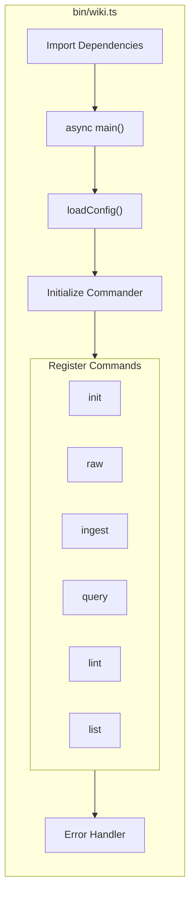

### Key Implementation

```typescript
// Configuration is loaded once and passed to all commands
const config = await loadConfig();

// Version comes from build-time define
program.version(__PKG_VERSION__);

// Each command receives config and options
program
    .command('init')
    .option('-f, --force', 'Force overwrite')
    .action((options) => initCmd(config, options));
```

### Design Patterns
- **Command Pattern:** Each CLI command is encapsulated
- **Dependency Injection:** Config passed to commands
- **Single Responsibility:** Only routing, no business logic

### Global Variable
- `__PKG_VERSION__`: Injected at build time by tsup

---

## File: `src/types/index.ts`

### Overview
**Purpose:** TypeScript type definitions and interfaces  
**Type:** Type Declaration Module  
**Lines:** ~30

### Key Interfaces

#### Config Interface
```typescript
interface Config {
    wikiRoot: string;
    llm: {
        provider: 'openai';
        model: string;
        apiKey?: string;
        baseUrl?: string;
        temperature: number;
        thinking?: {
            type: 'disabled' | 'enabled';
            budget_tokens?: number;
        };
    };
    paths: {
        raw: string;
        wiki: string;
        templates: string;
    };
}
```

### Design Rationale
- Centralized type definitions prevent drift
- Explicit typing enables IDE autocomplete
- Optional properties match runtime flexibility

---

## File: `src/core/wikiManager.ts`

### Overview
**Purpose:** Repository for all wiki file operations  
**Type:** Core Service Class  
**Complexity:** High  
**Lines:** ~250

### Class Architecture

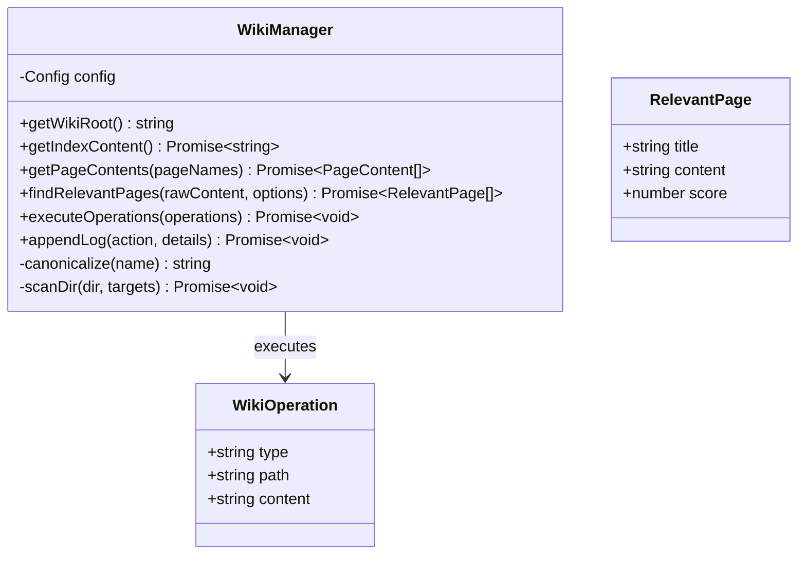

### Method Details

#### `getPageContents(pageNames: string[]): Promise<PageContent[]>`
**Purpose:** Retrieve content of multiple wiki pages

**Algorithm:**
1. Canonicalize target names (lowercase, alphanumeric)
2. Direct path access for path-like strings
3. Recursive directory scan for generic names
4. Fuzzy matching with safety constraints

**Time Complexity:** O(n × m) where n = files, m = filename length

**Implementation Highlights:**
```typescript
// Canonicalization for case-insensitive matching
const canonicalize = (n: string) => 
    n.toLowerCase().replace(/[^a-z0-9\u4e00-\u9fa5]/g, '');

// Direct path resolution for path-like strings
const possiblePaths = [
    path.resolve(this.config.wikiRoot, t.original),
    path.resolve(this.config.wikiRoot, this.config.paths.wiki, t.original)
];
```

#### `findRelevantPages(rawContent, options): Promise<RelevantPage[]>`
**Purpose:** Find existing pages related to new content

**Algorithm:**
1. Extract words (>3 chars) from raw content
2. Remove stop words
3. Score each wiki page by keyword matches
4. Bonus points for filename matches (+3 per match)
5. Filter by minScore, return topN

**Stop Words Set:**
```typescript
const stopWords = new Set([
    'that', 'this', 'with', 'from', 'they', 'have', 
    'what', 'when', 'will', 'your', 'into', 'more', ...
]);
```

**Scoring Example:**
```
Input: "machine learning tutorial"
Wiki Page: "machine-learning-basics.md" (contains "machine", "learning")
Score: 2 (content) + 6 (filename bonus for "machine" and "learning") = 8
```

#### `executeOperations(operations): Promise<void>`
**Purpose:** Apply LLM-generated file operations

**Security:** Path traversal protection
```typescript
const absolutePath = path.resolve(this.config.wikiRoot, op.path);
if (!absolutePath.startsWith(path.resolve(this.config.wikiRoot))) {
    throw new Error(`Path traversal detected: ${op.path}`);
}
```

**Operations Supported:**
- `create`: Write new file (uses safeWriteFile)
- `update`: Overwrite existing file
- `delete`: Remove file

#### `appendLog(action, details): Promise<void>`
**Purpose:** Chronicle wiki operations

**Format:**
```markdown
## [YYYY-MM-DD HH:mm] action | details
```

---

## File: `src/core/llmClient.ts`

### Overview
**Purpose:** Abstract LLM API communication  
**Type:** Service Class  
**Lines:** ~35

### Class Design

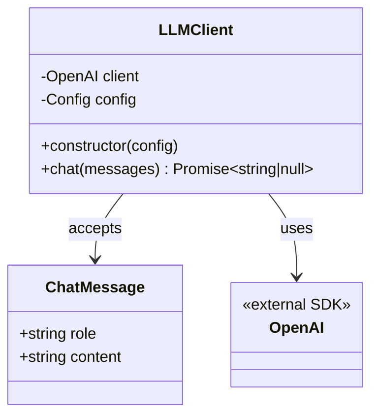

### Implementation Details

**Constructor Logic:**
```typescript
constructor(config: Config) {
    this.config = config;
    
    // Fallback to environment variable if not in config
    const apiKey = config.llm.apiKey || process.env.OPENAI_API_KEY;
    
    this.client = new OpenAI({
        apiKey,
        baseURL: config.llm.baseUrl,  // For proxies/alternate providers
    });
}
```

**Chat Method:**
```typescript
async chat(messages: ChatMessage[]): Promise<string | null> {
    const response = await this.client.chat.completions.create({
        model: this.config.llm.model,
        messages,
        temperature: this.config.llm.temperature,
        thinking: this.config.llm.thinking,
    } as any);
    
    return response.choices[0]?.message?.content || null;
}
```

**Features:**
- OpenAI-compatible API support (DeepSeek, Ollama, etc.)
- Environment variable fallback
- TypeScript type safety
- Null safety for empty responses
- Support for reasoning models (o1, o3) via `thinking` param

---

## File: `src/core/promptBuilder.ts`

### Overview
**Purpose:** Compile LLM prompts from templates  
**Type:** Service Class  
**Pattern:** Template Method  
**Lines:** ~55

### Architecture

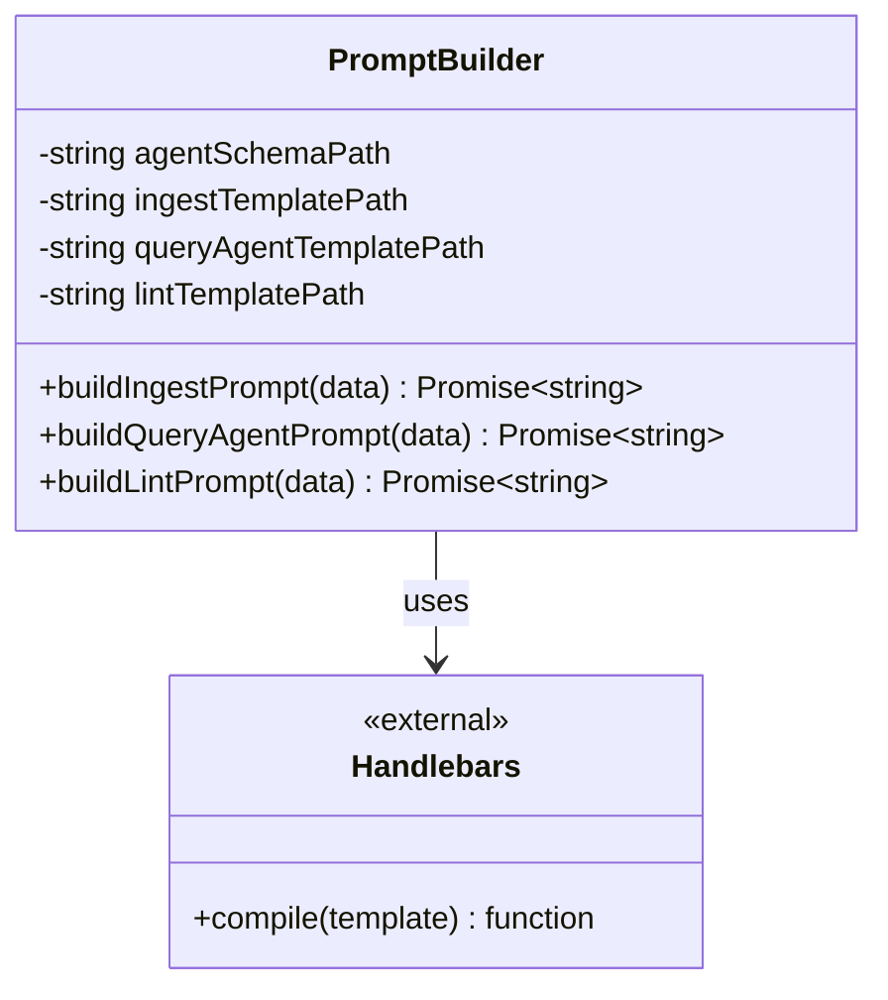

### Template Strategy

**Schema Hierarchy:**
```
agent.md (Universal Rules)
    ↓ embedded in ↓
ingest.prompt.hbs (Command-specific)
    ↓ renders ↓
Final Prompt with Data Injection
```

**Build Process:**
1. Load system schema (`agent.md`)
2. Load command template (e.g., `ingest.prompt.hbs`)
3. Compile with Handlebars
4. Inject runtime data
5. Return complete prompt string

**Data Structures:**

```typescript
// Ingest prompt data
interface IngestData {
    agentSystemPrompt: string;  // From agent.md
    sourcePath: string;
    rawContent: string;
    indexContent: string;
    relevantPages: Array<{title, content}>;
}

// Query prompt data
interface QueryData {
    question: string;
    indexContent: string;
    loadedPages: Array<{name, content}>;
}
```

**Handlebars Features Used:**
- Variable substitution: `{{sourcePath}}`
- Conditionals: `{{#if relevantPages}}...{{/if}}`
- Iteration: `{{#each relevantPages}}...{{/each}}`
- Partial templates: `{{agentSystemPrompt}}`

---

## File: `src/core/fileOps.ts`

### Overview
**Purpose:** Atomic file system operations  
**Type:** Utility Module  
**Lines:** ~25

### Function: `safeWriteFile`

```typescript
/**
 * Atomically writes a file by writing to a temporary file first and renaming.
 */
export async function safeWriteFile(
    filePath: string, 
    content: string
): Promise<void>
```

### Algorithm

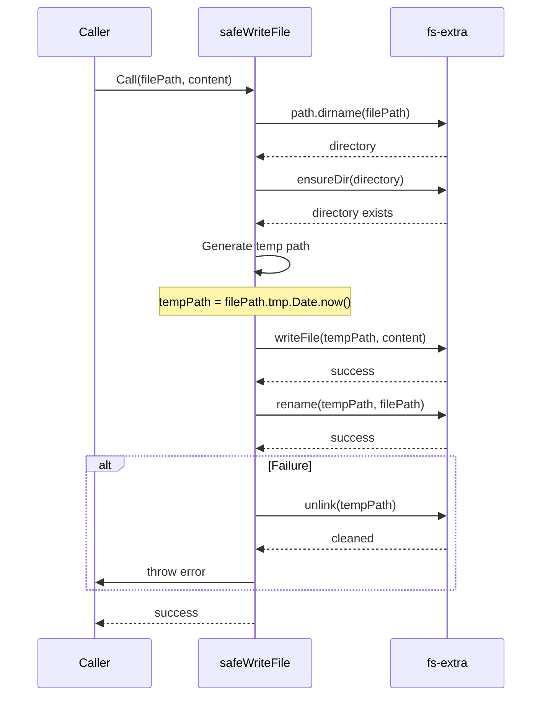

### Safety Guarantees
- Readers see old or new content, never partial
- On crash, temp file may remain but target is uncorrupted
- Directory creation is idempotent (`ensureDir`)

### Atomicity Properties
| Property | Implementation | Guarantee |
|----------|---------------|-----------|
| Atomic visibility | `rename()` syscall | Readers see complete file |
| Crash safety | Temp file cleanup | No data loss |
| Idempotency | `ensureDir()` | Can retry on failure |

---

## File: `src/config/loadConfig.ts`

### Overview
**Purpose:** Configuration discovery and loading  
**Type:** Utility Module  
**Pattern:** Strategy Pattern (cosmiconfig)  
**Lines:** ~45

### Configuration Discovery

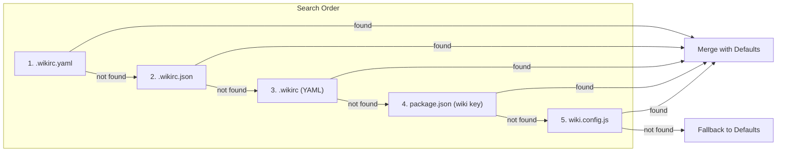

### Custom Loaders

```typescript
const explorer = cosmiconfig('wiki', {
    searchPlaces: [
        'package.json',
        '.wikirc',
        '.wikirc.json',
        '.wikirc.yaml',
        // ...
    ],
    loaders: {
        '.yaml': (filePath, content) => YAML.parse(content),
        '.yml': (filePath, content) => YAML.parse(content),
        noExt: (filePath, content) => YAML.parse(content),
    },
});
```

### Merge Strategy

```typescript
// Deep merge with defaults
return {
    ...defaultConfig,
    ...result.config,
    llm: {
        ...defaultConfig.llm,
        ...result.config?.llm,
    },
    paths: {
        ...defaultConfig.paths,
        ...result.config?.paths,
    },
};
```

**Priority:** User config fields override defaults, but nested objects are merged.

---

## File: `src/config/defaultConfig.ts`

### Overview
**Purpose:** Default configuration values  
**Type:** Constants Module  
**Lines:** ~20

### Default Values

```typescript
export const defaultConfig: Config = {
    wikiRoot: '.',              // Current directory
    llm: {
        provider: 'openai',     // Primary provider
        model: 'gpt-4o',        // Recommended model
        temperature: 0.3,       // Low = more deterministic
        thinking: {
            type: 'disabled',   // Reasoning models optional
        },
    },
    paths: {
        raw: 'raw',             // Source storage
        wiki: 'wiki',           // Knowledge base
        templates: 'templates', // CLI templates
    },
};
```

### Rationale
- `gpt-4o`: Good balance of quality and cost
- `temperature: 0.3`: Consistent output, less creative
- `wikiRoot: '.'`: Convention over configuration

---

## File: `src/commands/init.ts`

### Overview
**Purpose:** Initialize wiki directory structure  
**Type:** Command Handler  
**Lines:** ~70

### Algorithm

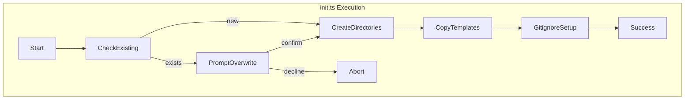

### Directory Structure Created

```
wmy-wiki/
├── .wikirc.yaml          ← Copied from templates
├── .gitignore            ← Created or modified
├── raw/
│   └── untracked/        ← For new sources
└── wiki/
    ├── index.md          ← Copied from templates
    └── log.md            ← Copied from templates
```

### Template Copying

```typescript
const cliWikiTemplatesDir = path.resolve(__dirname, '../../templates/wiki');
await fs.copy(
    path.join(cliWikiTemplatesDir, 'index.md'), 
    indexDest, 
    { overwrite: true }
);
```

### .gitignore Handling

```typescript
if (!await fs.pathExists(gitignoreDest)) {
    // Copy template
    await fs.copy(path.join(cliRootTemplatesDir, '_gitignore'), gitignoreDest);
} else {
    // Append if needed
    await fs.appendFile(gitignoreDest, '\n.wikirc.yaml\n');
}
```

---

## File: `src/commands/raw.ts`

### Overview
**Purpose:** Capture raw source documents  
**Type:** Command Handler  
**Lines:** ~70

### Data Flow

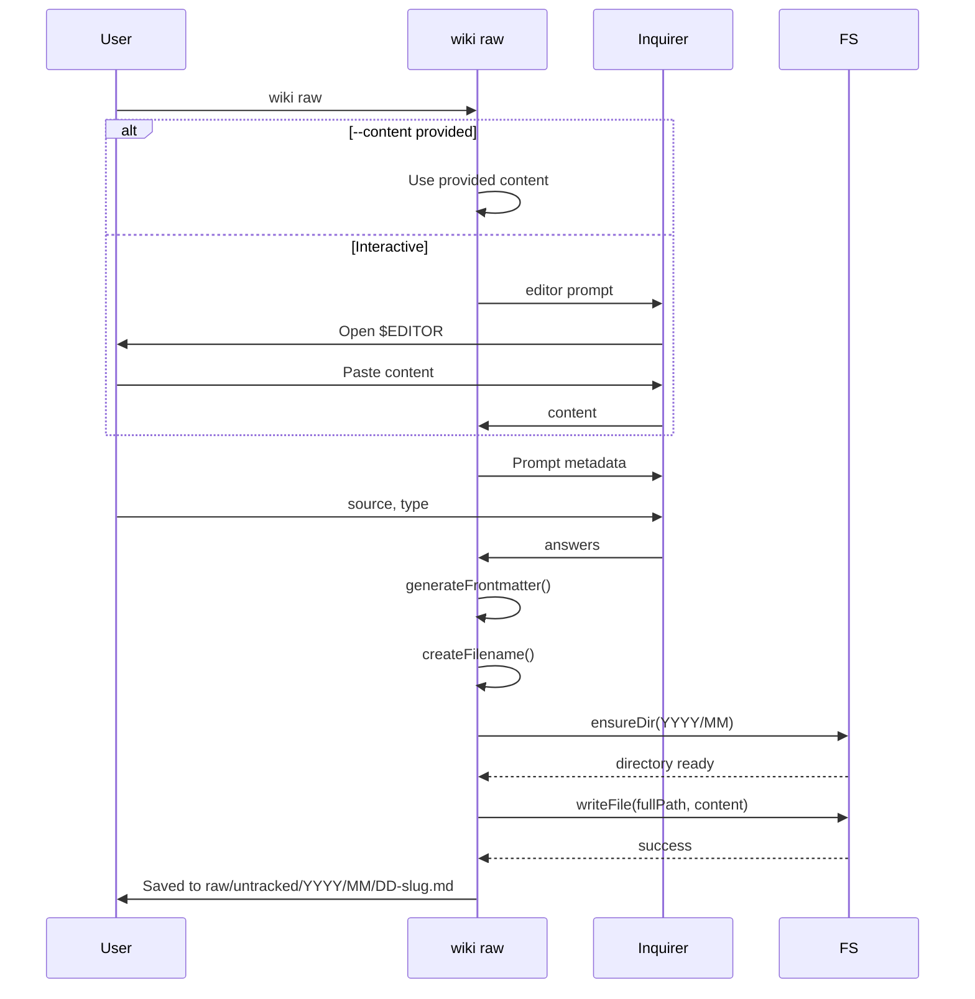

### Frontmatter Generation

```typescript
const frontmatter = `---
source: "${finalSource}"
date: ${dateStr}
type: ${finalType}
---\n\n`;
```

**Types:** `article`, `conversation`, `note`, `book-excerpt`, `code-snippet`, `other`

### Filename Generation

```typescript
const yyyy = now.getFullYear().toString();
const mm = String(now.getMonth() + 1).padStart(2, '0');
const dd = String(now.getDate()).padStart(2, '0');

// Slug: lowercase, hyphenated, limited length
const slug = finalSource
    .toLowerCase()
    .replace(/\s+/g, '-')
    .replace(/[^a-z0-9\u4e00-\u9fa5-]/g, '')
    .substring(0, 40);

const rawFileName = `${dd}-${slug}.md`;
```

### Collision Handling

```typescript
if (await fs.pathExists(finalPath)) {
    let counter = 2;
    while (await fs.pathExists(finalPath)) {
        finalPath = path.join(untrackedDir, `${dd}-${slug}-${counter}.md`);
        counter++;
    }
}
```

---

## File: `src/commands/ingest.ts`

### Overview
**Purpose:** Process raw sources using LLM  
**Type:** Command Handler  
**Complexity:** Very High  
**Lines:** ~150

### State Machine

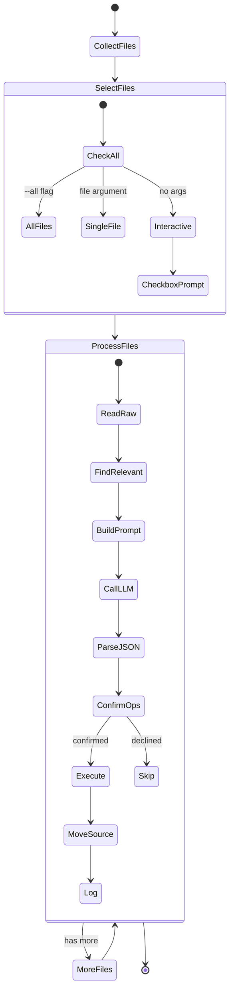

### Key Implementation

**Recursive File Collection:**
```typescript
async function collectMdFiles(dir: string, base: string): Promise<string[]> {
    const results: string[] = [];
    const entries = await fs.readdir(dir, { withFileTypes: true });
    
    for (const entry of entries) {
        const relPath = base ? `${base}/${entry.name}` : entry.name;
        if (entry.isDirectory()) {
            results.push(...await collectMdFiles(path.join(dir, entry.name), relPath));
        } else if (entry.isFile() && entry.name.endsWith('.md')) {
            results.push(relPath);
        }
    }
    return results;
}
```

**LLM Response Parsing:**
```typescript
// Extract JSON from markdown code blocks or raw
const jsonStart = response.indexOf('{');
const jsonEnd = response.lastIndexOf('}');
const rawJson = response.substring(jsonStart, jsonEnd + 1);

// Try parsing, fall back to repair
try {
    plan = JSON.parse(rawJson);
} catch {
    const repaired = jsonrepair(rawJson);
    plan = JSON.parse(repaired);
}
```

---

## File: `src/commands/query.ts`

### Overview
**Purpose:** Multi-step ReAct agent for queries  
**Type:** Command Handler  
**Complexity:** Very High  
**Lines:** ~170

### ReAct Agent Algorithm

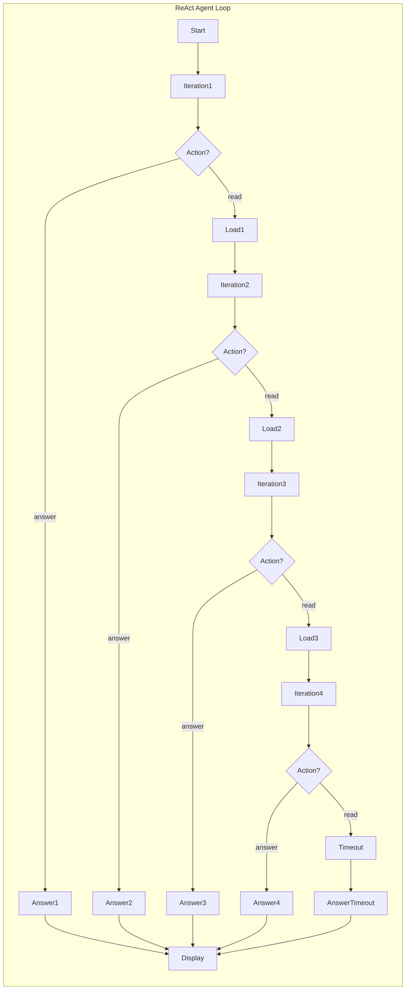

### Agent State

```typescript
const indexContent = await wm.getIndexContent();
const loadedPages: Array<{name, content}> = [];
let answerContent = '';
let iteration = 0;

while (iteration < MAX_ITERATIONS) {
    iteration++;
    
    // Build prompt with current state
    const prompt = await pb.buildQueryAgentPrompt({
        question: finalQuestion,
        indexContent,
        loadedPages
    });
    
    // Get agent action
    const response = await llm.chat([{ role: 'user', content: prompt }]);
    const action = parseJson(response);
    
    if (action.action === 'read') {
        // Agent wants more info
        const newPages = await wm.getPageContents(action.pages);
        loadedPages.push(...newPages);
        continue;
    } else if (action.action === 'answer') {
        // Agent is ready to answer
        answerContent = action.content;
        break;
    }
}
```

### Action Types

| Action | Purpose | Next Step |
|--------|---------|-----------|
| `read` | Load more pages | Continue loop |
| `answer` | Provide final answer | Break loop, display |

### Context Management

The `loadedPages` array grows across iterations:
- Iteration 1: Index only
- Iteration 2: Index + Concept Pages
- Iteration 3: Index + Concepts + Sources
- Iteration 4: Full context → Answer

---

## File: `src/commands/lint.ts`

### Overview
**Purpose:** Health check with static + LLM analysis  
**Type:** Command Handler  
**Lines:** ~250

### Two-Phase Analysis

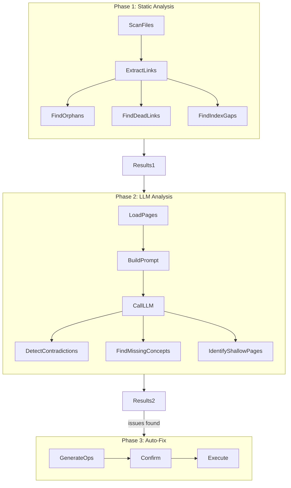

### Static Checks

#### Orphan Detection
```typescript
const orphans = pageFiles.filter(file => {
    const name = path.basename(file, '.md');
    const isLinked = [...allLinkedNames].some(link => 
        canonicalize(link) === canonicalize(name)
    );
    return !isLinked;
});
```

#### Dead Link Detection
```typescript
for (const link of links) {
    const exists = [...pageBasenames].some(b => 
        canonicalize(b) === canonicalize(link)
    );
    if (!exists) {
        deadLinks.push({ file, link });
    }
}
```

### LLM Analysis Report Structure

```typescript
{
    "contradictions": [
        { "pages": ["A", "B"], "description": "..." }
    ],
    "missing_concepts": [
        { "name": "Concept", "rationale": "..." }
    ],
    "index_gaps": [
        { "file": "...", "suggestion": "..." }
    ],
    "shallow_pages": [
        { "name": "...", "reason": "..." }
    ]
}
```

---

## File: `src/commands/list.ts`

### Overview
**Purpose:** Browse wiki contents  
**Type:** Command Handler  
**Lines:** ~130

### Subcommands

| Mode | Function | Output |
|------|----------|--------|
| `raw` | List raw sources | Untracked + Ingested |
| `pages` | List wiki pages | All .md files |
| `orphans` | Find disconnected pages | Pages with 0 backlinks |
| `backlinks "Page"` | Find references | Pages linking to target |

### Backlink Algorithm

```typescript
const targetCanon = canonicalize(target);
const backlinks = [];

for (const file of allWikiFiles) {
    const content = await fs.readFile(file, 'utf8');
    const matches = [...content.matchAll(/\[\[([^\]]+)\]\]/g)];
    
    const hasLink = matches.some(match => 
        canonicalize(match[1]) === targetCanon
    );
    
    if (hasLink) backlinks.push(file);
}
```

---

## File: `src/schemas/agent.md`

### Overview
**Purpose:** System prompt defining agent behavior  
**Type:** Schema/Markdown  
**Used By:** All LLM operations

### Rules Documented

1. **Maintain structure and connectivity**
2. **Always cite sources** - `[src: <path>]` mandatory
3. **Handle contradictions** - `> [!contradiction]` blockquotes
4. **Obsidian Link Strictness** - File must exist for `[[Link]]`
5. **Maintain central Index** - Update `wiki/index.md` on changes
6. **JSON Action Protocol** - Strict JSON output, no markdown

### Citation Syntax
```markdown
This claim is supported by evidence [src: raw/ingested/2026/04/article.md].
```

### Contradiction Syntax
```markdown
> [!contradiction]
> New source claims X, but previous source Y claimed Z.
```

---

## File: `src/schemas/ingest.prompt.hbs`

### Overview
**Purpose:** Template for ingestion workflow  
**Type:** Handlebars Template  
**Lines:** ~60

### Template Structure

```handlebars
{{agentSystemPrompt}}

---

## Raw Source Material
Path: {{sourcePath}}
{{rawContent}}

---

## Current Wiki Index
{{indexContent}}

{{#if relevantPages}}
## Relevant Existing Wiki Pages
{{#each relevantPages}}
### [[{{this.title}}]]
{{this.content}}
{{/each}}
{{/if}}

---

## Task
Process the `Raw Source Material` and update wiki...

Output:
{
  "operations": [...],
  "log_message": "..."
}
```

### Data Injected

| Variable | Source | Purpose |
|----------|--------|---------|
| `agentSystemPrompt` | `agent.md` | Universal rules |
| `sourcePath` | Command | Citation reference |
| `rawContent` | File system | Content to process |
| `indexContent` | `wiki/index.md` | Current structure |
| `relevantPages` | `findRelevantPages()` | Context for linking |

---

## File: `src/schemas/query_agent.prompt.hbs`

### Overview
**Purpose:** ReAct agent prompt for queries  
**Type:** Handlebars Template  
**Lines:** ~80

### ReAct Instructions

```handlebars
## Instructions
You operate in a continuous reasoning loop...

- **Dive deep (URGENT):** Read underlying Sources files
- **Full Detail Policy:** Don't settle for summaries
- **Infer Aliases:** Deduce full names from Index
- **Match Language:** Same language as Question

## JSON Action Protocol

### Format A: Synthesize Final Answer
```json
{
  "action": "answer",
  "content": "Your comprehensive answer..."
}
```

### Format B: Read More Pages
```json
{
  "action": "read",
  "reasoning": "Brief explanation",
  "pages": ["claude-code", "raw/ingested/xyz.md"]
}
```

```

### Special Directives

- **"Dive deep":** Must read `[src: ...]` cited sources
- **"Full Detail Policy":** For "detailed" questions, fetch original sources
- **Language matching:** Answer in same language as question

---

## File: `src/schemas/lint.prompt.hbs`

### Overview
**Purpose:** Template for health analysis  
**Type:** Handlebars Template  
**Lines:** ~50

### Task Definition

```
## Task
Perform the following checks:
1. **Contradictions:** Identify factual contradictions
2. **Missing Concepts:** Find frequently mentioned topics
3. **Index Gaps:** Pages not linked from index.md
4. **Stale or Shallow Pages:** Short/placeholder content

Output ONLY a strict JSON object:
{
  "contradictions": [...],
  "missing_concepts": [...],
  "index_gaps": [...],
  "shallow_pages": [...]
}
```

---

## Summary: Source Code Architecture

### File Dependency Graph

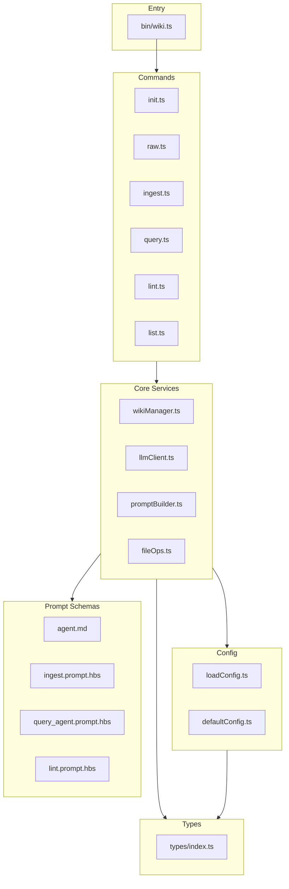

### Complexity Distribution

| Layer | Files | Lines | Complexity |
|-------|-------|-------|------------|
| Entry | 1 | 60 | Low |
| Commands | 6 | 750 | High |
| Core | 4 | 400 | Medium-High |
| Config | 2 | 70 | Low |
| Types | 1 | 30 | Low |
| Schemas | 4 | 200 | Medium |
| **Total** | **18** | **~1,500** | **High** |

### Design Principles

1. **Separation of Concerns:** Each module has single responsibility
2. **Dependency Injection:** Config passed rather than global
3. **Type Safety:** Full TypeScript coverage
4. **Error Resilience:** jsonrepair, path validation, atomic writes
5. **User Transparency:** Spinners, colored output, confirmation prompts

---

**Document End: Source Code File Documentation**