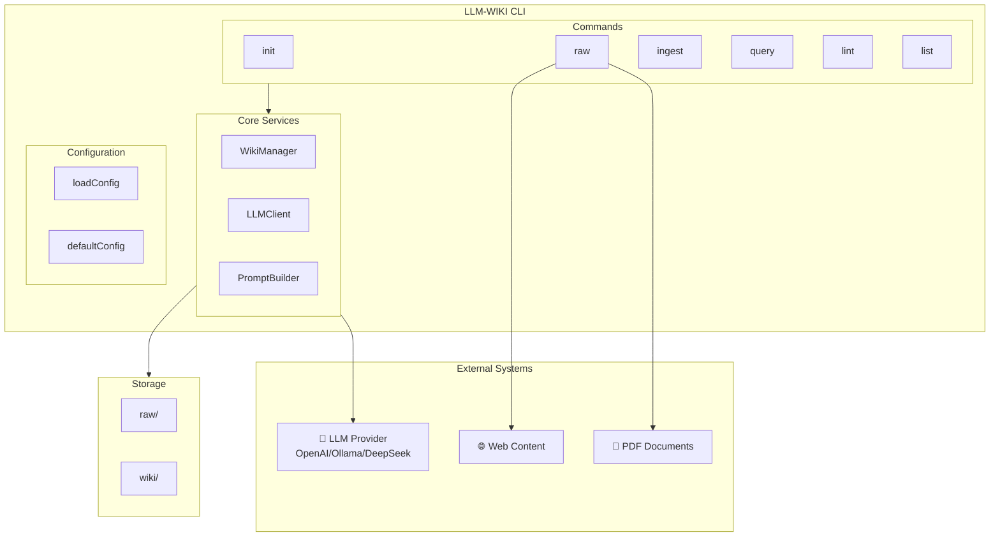
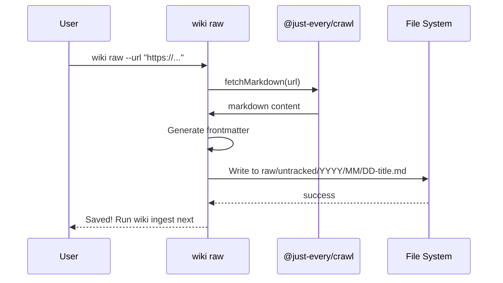
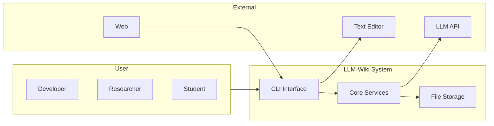
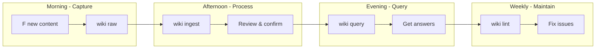

# User Guide: Managing Web Articles and PDF Documents with LLM-Wiki

**Version:** 1.0  
**Date:** April 2026

---

## Table of Contents

1. [Overview](#1-overview)
2. [Quick Start](#2-quick-start)
3. [Use Cases](#3-use-cases)
4. [System Architecture](#4-system-architecture)
5. [Workflows](#5-workflows)
6. [Command Reference](#6-command-reference)
7. [Configuration](#7-configuration)
8. [Tips and Best Practices](#8-tips-and-best-practices)

---

## 1. Overview

LLM-Wiki is a CLI tool that helps you build a persistent, interlinked knowledge base from raw source materials. It uses LLMs to transform web articles, PDF documents, and notes into structured wiki pages with automatic cross-linking and citations.

### Key Capabilities

- **Web Article Capture**: Fetch and store articles from any URL
- **PDF Support**: Add PDF content manually (via copy-paste or extraction)
- **Intelligent Processing**: LLM extracts concepts, creates links, and updates index
- **Natural Language Query**: Ask questions and get synthesized answers with source citations

---

## 2. Quick Start

### 2.1 Initialize Your Wiki

```bash
# Create a new wiki directory
mkdir my-knowledge-base
cd my-knowledge-base

# Initialize the wiki structure
wiki init
```

This creates:
```
my-knowledge-base/
├── raw/
│   ├── untracked/    # New sources pending ingestion
│   └── ingested/     # Processed sources
├── wiki/
│   ├── concepts/     # Extracted knowledge pages
│   ├── sources/     # Source attributions
│   ├── answers/     # Saved query responses
│   ├── index.md     # Master index
│   └── log.md       # Operation history
└── .wikirc.yaml     # Configuration
```

### 2.2 Configure LLM Provider

Edit `.wikirc.yaml`:

```yaml
# For OpenAI
llm:
  provider: openai
  model: gpt-4o
  apiKey: YOUR_API_KEY

# For Ollama (local)
llm:
  provider: ollama
  model: gemma4:e2b
  apiKey: ollama
  baseUrl: http://localhost:11434/v1
```

---

## 3. Use Cases

### UC1: Capture Web Article

```mermaid
useflow
    user(User)
    cli(CLI)
    crawler(Web Crawler)
    llm(LLM)
    wiki(Wiki Storage)

    user -> cli: wiki raw --url "https://example.com/article"
    cli -> crawler: Fetch URL content
    crawler -> cli: Markdown content
    cli -> cli: Add YAML frontmatter
    cli -> wiki: Save to raw/untracked/
    cli -> user: "Saved! Run 'wiki ingest' next"
```

**Scenario**: User finds an interesting article and wants to save it for later processing.

**Steps**:
1. Run `wiki raw --url "https://article-url"`
2. CLI fetches and converts to Markdown
3. User provides source description
4. File saved to `raw/untracked/YYYY/MM/`

### UC2: Ingest and Process Sources

```mermaid
useflow
    user(User)
    cli(CLI)
    wiki(WikiManager)
    llm(LLMClient)
    pb(PromptBuilder)
    fs(File System)

    user -> cli: wiki ingest --all
    cli -> wiki: Collect pending files
    wiki -> fs: List raw/untracked/*
    fs -> wiki: [file1.md, file2.md]
    
    loop For each file
        cli -> wiki: Read file content
        wiki -> fs: Read file
        fs -> cli: content
        
        cli -> wiki: Find relevant pages
        wiki -> cli: [related-page1, related-page2]
        
        cli -> pb: Build ingest prompt
        pb -> cli: prompt
        
        cli -> llm: Send to LLM
        llm -> cli: JSON operations
        
        cli -> user: Display proposed changes
        user -> cli: Confirm (y/n)
        
        alt Confirmed
            cli -> wiki: Execute operations
            wiki -> fs: Create/update concepts
            wiki -> fs: Update index.md
            cli -> fs: Move to ingested/
        end
    end
```

**Scenario**: Process all pending sources into structured wiki pages.

**Steps**:
1. Run `wiki ingest --all`
2. For each file, LLM proposes:
   - New concept pages to create
   - Updates to existing pages
   - Index entries to add
3. User reviews and confirms
4. Wiki updated, sources moved to `ingested/`

### UC3: Query Knowledge Base

```mermaid
useflow
    user(User)
    cli(CLI)
    agent(ReAct Agent)
    wiki(WikiManager)
    llm(LLMClient)

    user -> cli: wiki query "How does X work?"
    cli -> wiki: Load index.md
    wiki -> cli: Index content
    
    loop Max 4 iterations
        cli -> agent: Build query prompt
        agent -> llm: Send prompt
        llm -> agent: JSON action
        
        alt action.type == "read"
            agent -> wiki: Load specific pages
            wiki -> agent: Page contents
            agent -> cli: "Reading more pages..."
        else action.type == "answer"
            agent -> cli: Final answer
            break
        end
    end
    
    cli -> user: Display answer with [src] citations
    cli -> user: "Save to wiki?" (optional)
```

**Scenario**: User asks a question and gets a synthesized answer with source citations.

**Steps**:
1. Run `wiki query "your question"`
2. ReAct agent iterates (up to 4 times):
   - Reads index to find relevant pages
   - Loads additional pages as needed
   - Synthesizes answer
3. Answer displayed with `[src: wiki/path]` citations
4. Optional: Save answer to `wiki/answers/`

### UC4: Manage PDF Documents

```mermaid
useflow
    user(User)
    cli(CLI)
    extract(PDF Extractor)
    llm(LLM)
    wiki(Wiki Storage)

    user -> extract: Copy PDF text
    user -> cli: wiki raw --content "pasted text" --source "PDF Title" --type article
    cli -> cli: Add PDF frontmatter
    cli -> wiki: Save to raw/untracked/
    
    user -> cli: wiki ingest --all
    cli -> llm: Process with LLM
    llm -> wiki: Create concept pages
```

**Scenario**: User wants to add PDF content to their knowledge base.

**Note**: LLM-Wiki doesn't directly parse PDF files. Workflow:
1. Copy text from PDF (or use external tool like `pdftotext`)
2. Use `wiki raw --content` to add
3. Process with `wiki ingest`

---

## 4. System Architecture

### 4.1 Component Overview



### 4.2 Data Flow: Article Ingestion



### 4.3 Data Flow: Query Processing

```mermaid
sequenceDiagram
    participant User
    participant CLI as wiki query
    participant WM as WikiManager
    participant LC as LLMClient
    participant PB as PromptBuilder
    
    User->>CLI: "How does neural network work?"
    CLI->>WM: getIndexContent()
    WM-->>CLI: index.md content
    
    loop Max 4 iterations
        CLI->>PB: buildQueryAgentPrompt()
        PB-->>CLI: prompt with index + loaded pages
        
        CLI->>LC: chat(messages)
        LC-->>CLI: JSON response with action
        
        alt action.type === "read"
            CLI->>WM: getPageContents(pages)
            WM-->>CLI: page contents
        else action.type === "answer"
            CLI-->>User: Display answer with citations
            break
        end
    end
```

### 4.4 System Context



---

## 5. Workflows

### 5.1 Complete Article Workflow

```mermaid
flowchart TD
    A[Start] --> B[F found interesting article]
    B --> C{Run wiki raw}
    C --> D[wiki raw --url "url"]
    D --> E[Content fetched]
    E --> F[Add source description]
    F --> G[Saved to raw/untracked/]
    
    G --> H{Ready to process?}
    H -->|Yes| I[wiki ingest --all]
    I --> J[LLM processes each file]
    J --> K[Display proposed changes]
    K --> L{Confirm?}
    L -->|Yes| M[Execute changes]
    L -->|No| N[Skip]
    
    M --> O[Concept pages created]
    O --> P[Index updated]
    P --> Q[Moved to ingested/]
    
    R[Have a question?] --> S[wiki query "question"]
    S --> T[ReAct agent searches]
    T --> U[Answer with citations]
    
    Q --> R
    N --> B
```

### 5.2 PDF Document Workflow

```mermaid
flowchart TD
    A[Start] --> B[Open PDF document]
    B --> C[Copy relevant text]
    C --> D[External: Use pdftotext or copy-paste]
    
    D --> E{Method choice}
    E -->|Paste| F[wiki raw --content "text" --source "Title"]
    E -->|File| G[Extract to temp file]
    G --> F
    
    F --> H[Saved with PDF frontmatter]
    H --> I[wiki ingest --all]
    I --> J[LLM extracts concepts]
    J --> K[Created wiki pages]
    
    K --> L[Query anytime]
    L --> M[wiki query "question"]
```

### 5.3 Daily Usage Cycle



---

## 6. Command Reference

### 6.1 Raw Command - Add Sources

```bash
# Fetch web article
wiki raw --url "https://example.com/article"

# Paste content directly
wiki raw --content "Article text here" --source "Article Title"

# Use interactive editor
wiki raw

# Specify content type
wiki raw --url "..." --type article
```

**Options**:
| Option | Description |
|--------|-------------|
| `--url <url>` | Fetch content from URL |
| `--content <text>` | Direct content input |
| `--source <string>` | Source description |
| `--type <type>` | Content type (article, conversation, note, book-excerpt, code-snippet, other) |
| `--batch <dir>` | Batch import from directory |

### 6.2 Ingest Command - Process Sources

```bash
# Ingest specific file
wiki ingest raw/untracked/2025/04/01-article.md

# Ingest all pending sources
wiki ingest --all

# Dry run (show logic without writing)
wiki ingest --all --dry-run

# Skip confirmations
wiki ingest --all --yes

# Show debug payload
wiki ingest --all --debug
```

### 6.3 Query Command - Ask Questions

```bash
# Simple query
wiki query "How does attention mechanism work?"

# Verbose output
wiki query "question" --verbose

# JSON output
wiki query "question" --format json
```

### 6.4 List Command - Explore Wiki

```bash
# List pending raw sources
wiki list raw

# List all wiki pages
wiki list pages

# Find orphan pages
wiki list orphans

# Show backlinks
wiki list backlinks "Page Name"
```

### 6.5 Lint Command - Health Check

```bash
# Static analysis only
wiki lint --skip-llm

# Full check with LLM
wiki lint

# Auto-fix issues
wiki lint --fix
```

---

## 7. Configuration

### 7.1 Configuration File (.wikirc.yaml)

```yaml
# Wiki root directory
wikiRoot: "."

# LLM Configuration
llm:
  provider: openai       # openai, ollama, deepseek
  model: gpt-4o         # Model name
  apiKey: YOUR_KEY      # Or use OPENAI_API_KEY env var
  baseUrl: https://api.openai.com/v1  # For proxies/custom endpoints
  temperature: 0.3      # Lower = more consistent

# Paths
paths:
  raw: raw
  wiki: wiki
  templates: templates
```

### 7.2 Ollama Configuration Example

```yaml
# .wikirc-ollama.yaml
llm:
  provider: ollama
  model: gemma4:e2b      # Or llama3.2, qwen2.5:7b, etc.
  apiKey: ollama         # Any non-empty string
  baseUrl: http://localhost:11434/v1
  temperature: 0.3
```

Use with: `wiki --config .wikirc-ollama.yaml query "question"`

### 7.3 Environment Variables

```bash
# OpenAI
export OPENAI_API_KEY="sk-..."
export OPENAI_BASE_URL="https://api.openai.com/v1"

# Ollama
export OPENAI_API_KEY="ollama"
export OPENAI_BASE_URL="http://localhost:11434/v1"
```

---

## 8. Tips and Best Practices

### 8.1 Effective Article Capture

1. **Capture immediately**: When you find something useful, run `wiki raw --url` right away
2. **Add good descriptions**: The source description helps LLM categorize and link content
3. **Use consistent types**: Stick to `article` for web content, `book-excerpt` for PDFs

### 8.2 Organization Tips

```
raw/
├── untracked/
│   ├── 2026/
│   │   └── 04/
│   │       ├── 01-ai-trends.md
│   │       └── 02-python-tips.md
└── ingested/
    └── ... (processed files)
```

### 8.3 Query Strategies

- **Be specific**: "How does transformer attention work?" works better than "attention"
- **Iterate**: If answer is incomplete, ask follow-up
- **Save valuable answers**: Save queries that produce useful summaries

### 8.4 Maintenance

- Run `wiki lint` weekly to catch broken links
- Use `wiki list orphans` to find unlinked pages
- Keep index.md updated (LLM does this during ingest)

---

## Appendix: File Structure

```
llm-wiki/
├── bin/wiki.ts          # CLI entry point
├── src/
│   ├── commands/        # CLI commands
│   │   ├── init.ts
│   │   ├── raw.ts
│   │   ├── ingest.ts
│   │   ├── query.ts
│   │   ├── lint.ts
│   │   └── list.ts
│   ├── core/            # Core services
│   │   ├── wikiManager.ts
│   │   ├── llmClient.ts
│   │   └── promptBuilder.ts
│   ├── config/          # Configuration
│   └── types/           # TypeScript types
├── templates/           # Wiki templates
└── dist/               # Built output
```

---

**End of User Guide**