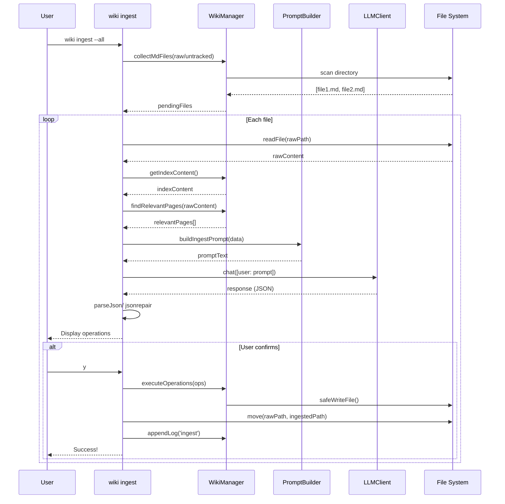
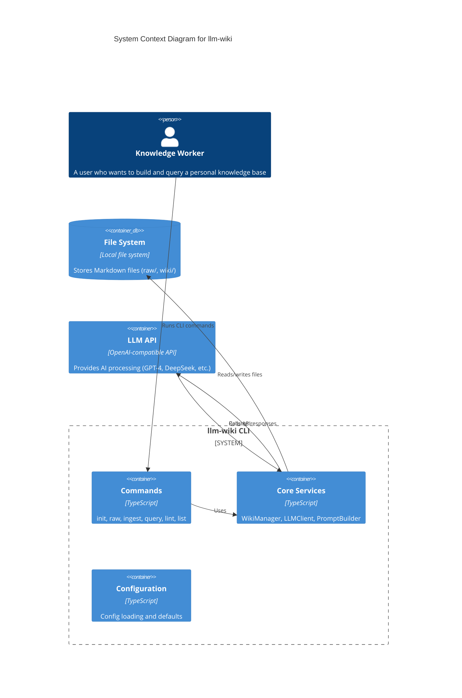

# llm-wiki User Guide & Use Cases

**Version:** 1.0  
**Date:** 2026-04-08

---

## Table of Contents

1. [Quick Start](#1-quick-start)
2. [Use Cases](#2-use-cases)
3. [Workflows](#3-workflows)
4. [Command Reference](#4-command-reference)
5. [Diagrams](#5-diagrams)

---

## 1. Quick Start

```bash
# 1. Install
npm install -g llm-wiki

# 2. Initialize wiki
mkdir my-wiki && cd my-wiki
wiki init

# 3. Configure (edit .wikirc.yaml with your API key)

# 4. Add a source
wiki raw

# 5. Ingest into wiki
wiki ingest

# 6. Query your knowledge
wiki query "How do I use Claude Code?"
```

---

## 2. Use Cases

### UC-1: Building a Personal Knowledge Base

```
┌─────────────────────────────────────────────────────────────────┐
│                     USE CASE: Knowledge Building               │
├─────────────────────────────────────────────────────────────────┤
│ Actor: Knowledge Worker                                         │
│ Goal: Accumulate and structure knowledge from sources          │
│                                                                  │
│ Steps:                                                           │
│   1. User encounters valuable information                       │
│   2. Run `wiki raw` to capture source                           │
│   3. Run `wiki ingest` to process with LLM                     │
│   4. LLM creates concept pages with citations                   │
│   5. LLM updates index.md with links                           │
│   6. Knowledge is permanently integrated                        │
│                                                                  │
│ Result: Structured, interconnected wiki that grows smarter    │
└─────────────────────────────────────────────────────────────────┘
```

### UC-2: Research & Question Answering

```
┌─────────────────────────────────────────────────────────────────┐
│                     USE CASE: Research Query                   │
├─────────────────────────────────────────────────────────────────┤
│ Actor: Researcher                                               │
│ Goal: Get synthesized answer with source citations             │
│                                                                  │
│ Steps:                                                           │
│   1. User has a question                                        │
│   2. Run `wiki query "question"`                                │
│   3. ReAct agent reads index.md                                 │
│   4. Agent iteratively reads concept pages                     │
│   5. Agent dives into source files if needed                    │
│   6. Agent synthesizes answer with [src] citations              │
│   7. User optionally saves answer to wiki                       │
│                                                                  │
│ Result: Cited, synthesized answer from your knowledge base     │
└─────────────────────────────────────────────────────────────────┘
```

### UC-3: Wiki Health Maintenance

```
┌─────────────────────────────────────────────────────────────────┐
│                     USE CASE: Health Check                     │
├─────────────────────────────────────────────────────────────────┤
│ Actor: Wiki Maintainer                                          │
│ Goal: Detect and fix structural/semantic issues                │
│                                                                  │
│ Steps:                                                           │
│   1. Run `wiki lint`                                            │
│   2. Phase 1: Static analysis (orphans, dead links)            │
│   3. Phase 2: LLM analysis (contradictions, gaps)              │
│   4. Review issues found                                        │
│   5. Run `wiki lint --fix` to auto-apply solutions             │
│                                                                  │
│ Result: Healthy wiki with no broken links or orphans           │
└─────────────────────────────────────────────────────────────────┘
```

---

## 3. Workflows

### 3.1 Daily Knowledge Capture Workflow

```
┌──────────────────────────────────────────────────────────────────────────┐
│                    WORKFLOW: Daily Knowledge Capture                     │
└──────────────────────────────────────────────────────────────────────────┘

     ┌──────────┐     ┌──────────┐     ┌──────────┐     ┌──────────┐
     │ Encounter│────▶│   wiki   │────▶│   wiki   │────▶│  Result  │
     │  Source  │     │   raw    │     │  ingest  │     │  Stored  │
     └──────────┘     └──────────┘     └──────────┘     └──────────┘
         │                │                │                │
         ▼                ▼                ▼                ▼
    "Found an          Prompts for       LLM creates     Source moved
     interesting       content, source   pages, links    to ingested/
     article"          type              to index"        Index updated
```

**Detailed Steps:**
```
1. Read article/note/conversation
2. $ wiki raw
3. Paste content in editor (or use --content flag)
4. Enter source description: "Claude Code Tips Article"
5. Select type: "article"
6. File saved: raw/untracked/2026/04/08-claude-code-tips.md
7. $ wiki ingest
8. Select file(s) to process
9. Review proposed operations (create/update/delete)
10. Confirm to apply
11. Source moved to raw/ingested/
12. Concept pages created in wiki/concepts/
13. index.md updated with links
```

### 3.2 Research Workflow

```
┌──────────────────────────────────────────────────────────────────────────┐
│                         WORKFLOW: Research Query                        │
└──────────────────────────────────────────────────────────────────────────┘

  User ──▶ wiki query ──▶ ReAct Agent ──▶ Iterative Retrieval ──▶ Answer
                              │                    │
                              │    ┌───────────┐   │
                              │    │  Read     │   │
                              │    │  Index    │───┘
                              │    └───────────┘
                              │         │
                              │    ┌───────────┐
                              │    │  Read     │──▶ wiki/concepts/
                              │    │  Concepts │   
                              │    └───────────┘
                              │         │
                              │    ┌───────────┐
                              │    │  Dive     │──▶ wiki/sources/
                              │    │  Sources  │    (if cited)
                              │    └───────────┘
                              │         │
                              ▼         ▼
                         ┌─────────────┐
                         │ Synthesize  │
                         │   Answer    │
                         └─────────────┘
```

### 3.3 Maintenance Workflow

```
┌──────────────────────────────────────────────────────────────────────────┐
│                      WORKFLOW: Wiki Maintenance                          │
└──────────────────────────────────────────────────────────────────────────┘

  $ wiki lint ──▶ Phase 1 (Static) ──▶ Phase 2 (LLM) ──▶ Review Issues
                       │                     │                  │
                       │  - Orphans          │  - Contradictions│
                       │  - Dead links       │  - Missing concepts
                       │  - Index gaps       │  - Shallow pages  │
                       │                     │                  │
                       ▼                     ▼                  ▼
                  ┌──────────────────────────────────────────────────┐
                  │              Analysis Complete                     │
                  └──────────────────────────────────────────────────┘
                                    │
                                    ▼
                            ┌───────────────┐
                            │ Run --fix?    │
                            └───────────────┘
                               │        │
                              Yes       No
                               │        │
                               ▼        ▼
                    ┌──────────────┐  ┌────────────┐
                    │ Auto-create │  │   Done     │
                    │ stubs &     │  │  (manual   │
                    │ update index│  │  review)   │
                    └──────────────┘  └────────────┘
```

---

## 4. Command Reference

| Command | Description | Example |
|---------|-------------|---------|
| `wiki init` | Initialize wiki structure | `wiki init -f` |
| `wiki raw` | Add raw source | `wiki raw --content "..." --source "Article"` |
| `wiki ingest` | Process sources | `wiki ingest --all -y` |
| `wiki query` | Query wiki | `wiki query "How does X work?"` |
| `wiki lint` | Health check | `wiki lint --fix` |
| `wiki list` | Browse items | `wiki list orphans` |

---

## 5. Diagrams

### 5.1 Use Case Diagram (C4 Level 1)

```
┌─────────────────────────────────────────────────────────────────────────┐
│                         llm-wiki System                                  │
└─────────────────────────────────────────────────────────────────────────┘

    ┌─────────┐     ┌─────────┐     ┌─────────┐     ┌─────────┐
    │  User   │     │  User   │     │  User   │     │  User   │
    └────┬────┘     └────┬────┘     └────┬────┘     └────┬────┘
         │               │               │               │
         │               │               │               │
    ┌────▼────┐     ┌────▼────┐     ┌────▼────┐     ┌────▼────┐
    │  init   │     │  raw    │     │ ingest  │     │ query   │
    │ Command │     │ Command │     │ Command │     │ Command │
    └────┬────┘     └────┬────┘     └────┬────┘     └────┬────┘
         │               │               │               │
         │               │               │               │
    ┌────▼────────────────▼──────────────▼──────────────▼────┐
    │                    WikiManager                         │
    │    ┌─────────┐  ┌─────────┐  ┌─────────┐               │
    │    │  File   │  │  LLM    │  │ Prompt  │               │
    │    │  Ops    │  │ Client  │  │Builder  │               │
    │    └─────────┘  └─────────┘  └─────────┘               │
    └────┬────────────────────────────┬──────────────────────┘
         │                           │
    ┌────▼────────┐            ┌─────▼──────┐
    │ File System │            │ LLM API    │
    │ (Wiki Data) │            │ (External) │
    └─────────────┘            └────────────┘
```

### 5.2 Sequence Diagram: Ingest Command



### 5.3 Sequence Diagram: Query Command

```mermaid
sequenceDiagram
    participant U as User
    participant CLI as wiki query
    participant WM as WikiManager
    participant PB as PromptBuilder
    participant LLM as LLMClient

    U->>CLI: wiki query "How to use X?"
    CLI->>WM: getIndexContent()
    WM-->>CLI: indexContent
    CLI->>CLI: loadedPages = []
    
    loop max 4 iterations
        CLI->>PB: buildQueryAgentPrompt(question, index, loadedPages)
        PB-->>CLI: promptText
        CLI->>LLM: chat([user: prompt])
        LLM-->>CLI: response {action, pages?}
        
        alt action == "read"
            CLI->>U: Agent wants to read: pages
            CLI->>WM: getPageContents(pages)
            WM-->>CLI: newPages[]
            CLI->>CLI: loadedPages.push(newPages)
        else action == "answer"
            CLI-->>CLI: answerContent = response.content
            break
        end
    end
    
    CLI-->>U: Display answer with [src] citations
    
    alt Save option
        U->>CLI: y
        CLI->>WM: create wiki/answers/page.md
        CLI-->>U: Saved!
    end
```

### 5.4 Component Diagram

```
┌─────────────────────────────────────────────────────────────────────────────┐
│                           llm-wiki Architecture                              │
└─────────────────────────────────────────────────────────────────────────────┘

┌─────────────────────────────────────────────────────────────────────────────┐
│                              CLI Entry (bin/wiki.ts)                         │
│                           Commands: init, raw, ingest, query, lint, list    │
└─────────────────────────────────────────────────────────────────────────────┘
                                        │
        ┌───────────────┬───────────────┼───────────────┬───────────────┐
        │               │               │               │               │
   ┌────▼────┐    ┌────▼────┐    ┌────▼────┐    ┌────▼────┐    ┌────▼────┐
   │  init   │    │  raw    │    │ ingest  │    │ query   │    │  lint   │
   └────┬────┘    └────┬────┘    └────┬────┘    └────┬────┘    └────┬────┘
        │               │               │               │               │
        └───────────────┴───────┬───────┴───────────────┴───────────────┘
                                │
                 ┌──────────────┼──────────────┐
                 │              │              │
            ┌────▼─────┐  ┌─────▼─────┐  ┌────▼──────┐
            │   File   │  │   LLM     │  │  Prompt   │
            │  Ops     │  │  Client   │  │  Builder  │
            └────┬─────┘  └─────┬─────┘  └────┬──────┘
                 │              │              │
                 └──────────────┼──────────────┘
                                │
         ┌──────────────────────┼──────────────────────┐
         │                      │                      │
    ┌────▼─────┐         ┌──────▼─────┐        ┌─────▼─────┐
    │   File   │         │  LLM API   │        │ Handlebars│
    │ System   │         │ (OpenAI)   │        │ Templates │
    └──────────┘         └────────────┘        └───────────┘
```

### 5.5 Data Flow Diagram

```
┌─────────────────────────────────────────────────────────────────────────────┐
│                         Ingestion Data Flow                                  │
└─────────────────────────────────────────────────────────────────────────────┘

    ┌─────────────┐      ┌─────────────┐      ┌─────────────┐
    │    Raw     │      │   Keyword   │      │   Relevant  │
    │  Source    │────▶│  Extraction │────▶│    Pages    │
    │  (MD)      │      │             │      │  Matching   │
    └─────────────┘      └─────────────┘      └──────┬──────┘
                                                    │
                                                    ▼
    ┌─────────────┐      ┌─────────────┐      ┌─────────────┐
    │   Index     │◀─────│    LLM      │◀─────│   Prompt    │
    │   Updated   │      │  Processing │      │  Generation │
    └─────────────┘      └──────┬──────┘      └─────────────┘
                                │
                                ▼
    ┌─────────────┐      ┌─────────────┐      ┌─────────────┐
    │    Wiki    │◀─────│   Parse &    │◀─────│     LLM     │
    │   Pages    │      │   Validate   │      │   Response  │
    │ Created    │      │   (JSON)     │      │             │
    └─────────────┘      └─────────────┘      └─────────────┘
```

### 5.6 C4 Container Diagram



### 5.7 State Diagram: Source Lifecycle

```
┌─────────────────────────────────────────────────────────────────────────────┐
│                       Source File Lifecycle                                 │
└─────────────────────────────────────────────────────────────────────────────┘

    ┌─────────────┐     ┌─────────────┐     ┌─────────────┐     ┌─────────────┐
    │  Untracked │────▶│  Processing │────▶│   Ingested  │     │   Updated   │
    │   (raw/    │     │  (ingest    │     │   (raw/     │     │   (future   │
    │  untracked)│     │   command)  │     │  ingested)  │     │   re-ingest)│
    └─────────────┘     └──────┬──────┘     └─────────────┘     └─────────────┘
           │                    │                   │
           │                    ▼                   │
           │             ┌─────────────┐            │
           │             │   Failed    │            │
           │             │  (skipped)  │            │
           │             └─────────────┘            │
           │                    │                    │
           └────────────────────┴────────────────────┘
                         State Transitions:
                         
    untracked --[wiki ingest + confirm]--> ingested
    untracked --[skipped]--> untracked (unchanged)
    ingested --[edit source]--> (user edits file)
    ingested --[re-ingest]--> ingested (update)
```

### 5.8 Query Agent State Machine

```
┌─────────────────────────────────────────────────────────────────────────────┐
│                    ReAct Query Agent State Machine                          │
└─────────────────────────────────────────────────────────────────────────────┘

       ┌─────────────────────────────────────────────────────────────────┐
       │                        START                                      │
       │                   (question received)                             │
       └─────────────────────────────┬───────────────────────────────────┘
                                     │
                                     ▼
       ┌─────────────────────────────────────────────────────────────────┐
       │                    READ INDEX                                    │
       │              (load wiki/index.md)                               │
       └─────────────────────────────┬───────────────────────────────────┘
                                     │
                                     ▼
       ┌─────────────────────────────────────────────────────────────────┐
       │                    AGENT LOOP                                    │
       │              (max 4 iterations)                                  │
       │  ┌────────────────────────────────────────────────────────────┐ │
       │  │                     DECIDE                                 │ │
       │  │  ┌──────────────────┐  ┌──────────────────┐              │ │
       │  │  │ Need more info?  │  │ Can answer now?  │              │ │
       │  │  │    (action=read) │  │  (action=answer) │              │ │
       │  │  └────────┬─────────┘  └────────┬─────────┘              │ │
       │  │           │                    │                        │ │
       │  │           ▼                    ▼                        │ │
       │  │  ┌──────────────────┐  ┌──────────────────┐              │ │
       │  │  │   READ PAGES    │  │  SYNTHESIZE       │              │ │
       │  │  │ (load concept   │  │  ANSWER with      │              │ │
       │  │  │  pages, sources)│  │  [src] citations │              │ │
       │  │  └──────────────────┘  └──────────────────┘              │ │
       │  └────────────────────────────────────────────────────────────┘ │
       └─────────────────────────────┬───────────────────────────────────┘
                                     │
                    ┌────────────────┴────────────────┐
                    │                                 │
                    ▼                                 ▼
          ┌──────────────────┐            ┌──────────────────┐
          │    iteration < 4  │            │   iteration >= 4 │
          │    Continue loop  │            │  or action=answer│
          └──────────────────┘            └────────┬─────────┘
                                                  │
                                                  ▼
                                        ┌──────────────────┐
                                        │      END         │
                                        │   (display answer│
                                        │   optionally save)│
                                        └──────────────────┘
```

---

## Appendix: Directory Structure

```
my-wiki/
├── .wikirc.yaml          ← Config (API key here)
├── .gitignore
├── raw/
│   ├── untracked/        ← New sources
│   │   └── YYYY/MM/DD-*.md
│   └── ingested/         ← Processed sources
│       └── YYYY/MM/DD-*.md
└── wiki/
    ├── index.md          ← Auto-maintained index
    ├── log.md            ← Operation history
    ├── concepts/         ← LLM-generated concept pages
    ├── answers/          ← Saved query answers
    └── sources/          ← Source attribution pages
```

---

**Document End**
